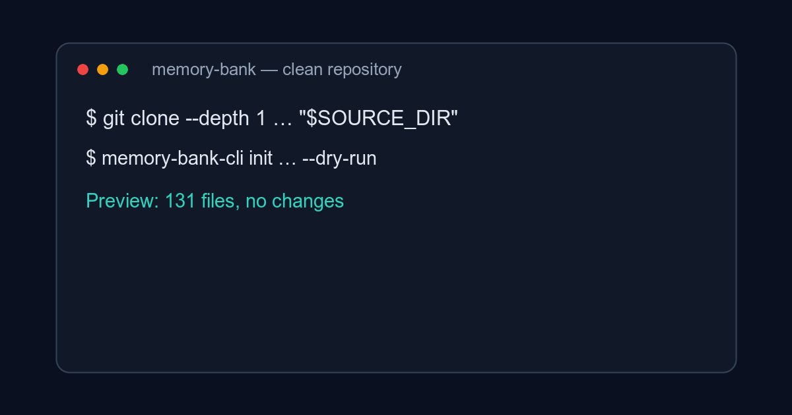

# Memory Bank

**A durable, version-controlled context and governance layer for software development with coding agents.**

[Русская версия](README.ru.md) · [Adoption guide](docs/adoption.md) · [Daily usage](docs/usage.md) · [CLI](https://github.com/dapi/memory-bank-cli)

**`AGENTS.md` can tell an agent how to start. Memory Bank preserves what the project means, why decisions were made, and how work is verified.**

<p align="center">
  
</p>

Coding agents are most useful when they share the same understanding of the product, domain, architecture, constraints, and definition of done. Memory Bank keeps that knowledge in Git, next to the code, instead of leaving it in one person's head or a disposable chat session.

It gives humans and agents an authoritative starting point, routes work through explicit delivery flows, and preserves the decisions and evidence needed to resume a task in a fresh session.

Memory Bank is not a wiki, task tracker, or agent runner. It is the control plane around those tools: durable context, ownership rules, lifecycle gates, and verification contracts.

Use it when a project has one or more of these symptoms:

- a fresh agent has to reconstruct product intent from chat history;
- the same rule appears in several documents and drifts;
- implementation starts before requirements, risks, or acceptance are clear;
- a task cannot be resumed without the person who ran the previous session;
- a successful test is reported without a durable link to what was verified.

## What you get

- **Durable project context** — product intent, domain language, engineering rules, and operational constraints survive across sessions.
- **Clear ownership** — Single Source of Truth rules prevent the same fact from drifting across documents.
- **Governed delivery** — task routing selects the smallest suitable flow for incidents, bugs, research, small changes, epics, refactoring, or features.
- **Safe reuse and updates** — an ownership-aware CLI installs the template, preserves local customizations, and reports conflicts.
- **Automated checks** — `lint` audits links and navigation; `doctor` checks adoption, governance, managed drift, and CI integration.

```text
Memory Bank context and rules
             ↓
         Issue / task
             ↓
   Agent session and delivery flow
             ↓
 Implementation → verification → PR
             ↓
 New durable knowledge returns to Memory Bank
```

## Quick Start

Install the companion CLI with Go:

```sh
go install github.com/dapi/memory-bank-cli/cmd/memory-bank-cli@latest
```

Then, from the root of your Git repository:

```sh
SOURCE_DIR="$(mktemp -d)/memory-bank"
git clone --depth 1 https://github.com/dapi/memory-bank.git "$SOURCE_DIR"
SOURCE_REF="$(git -C "$SOURCE_DIR" rev-parse HEAD)"

memory-bank-cli init --source "$SOURCE_DIR" --template-version "$SOURCE_REF" --source-ref "$SOURCE_REF" --dry-run
memory-bank-cli init --source "$SOURCE_DIR" --template-version "$SOURCE_REF" --source-ref "$SOURCE_REF"
memory-bank-cli doctor
```

`--dry-run` previews every file before installation. `init` installs the clean checkout pinned by `SOURCE_REF`, creates `memory-bank/.lock`, and adds a managed Memory Bank block to the repository's agent instructions. For reproducible automation, pin both a released CLI version and a released template tag instead of using their latest revisions.

Next, open `memory-bank/README.md` and adapt `product/`, `domain/`, `engineering/`, and `ops/` to the actual project. Generic template text is not evidence about an existing codebase: brownfield projects should follow the [brownfield adaptation protocol](docs/brownfield-adaptation-protocol.md), while new projects can use the [greenfield protocol](docs/greenfield-integration-protocol.md).

See the complete [adoption guide](docs/adoption.md) for agent setup, local validation, and downstream CI.

## How it works

The `dna/` layer defines document governance: source ownership, dependency direction, lifecycle, frontmatter, and navigation. Stable project context lives in `product/`, `domain/`, `engineering/`, and `ops/`. Requirements and decisions mature through research, PRDs, epics, use cases, feature packages, and ADRs.

For a substantial delivery feature, the context typically develops in three stages:

```text
brief.md                 design.md                  implementation-plan.md
what and why      →      chosen solution     →     implementation and checks
problem space            solution space             execution space
                         (when required)
```

Documents own intent, requirements, rationale, and contracts. Code owns implementation. A new agent session can therefore restart from the same task and canonical documents without reconstructing the project from chat history.

Every task begins with [Task Routing](template/memory-bank/flows/routing.md), which selects the applicable lifecycle and its evidence requirements.

## Template layout

This repository is the upstream source. `memory-bank-cli init` installs tracked regular files from `template/` into a downstream repository: `template/memory-bank/` becomes `memory-bank/`, while `template/init.sh` becomes `./init.sh`.

| Area | Purpose |
| --- | --- |
| [`dna/`](template/memory-bank/dna/README.md) | Governance, Single Source of Truth, lifecycle, and document contracts |
| [`product/`](template/memory-bank/product/README.md) | Vision, customers, metrics, marketing, and roadmap |
| [`domain/`](template/memory-bank/domain/README.md) | Glossary, domain model, rules, states, events, and context map |
| [`engineering/`](template/memory-bank/engineering/README.md) | Architecture, testing, coding style, Git workflow, and agent autonomy |
| [`ops/`](template/memory-bank/ops/README.md) | Development, environments, configuration, releases, and runbooks |
| [`research/`](template/memory-bank/research/README.md), [`prd/`](template/memory-bank/prd/README.md), [`epics/`](template/memory-bank/epics/README.md) | Discovery and initiative-level planning |
| [`use-cases/`](template/memory-bank/use-cases/README.md), [`features/`](template/memory-bank/features/README.md), [`adr/`](template/memory-bank/adr/README.md) | Scenarios, delivery packages, and architecture decisions |
| [`flows/`](template/memory-bank/flows/README.md) | Task lifecycles and reusable document templates |

After installation, `memory-bank/README.md` is the primary index inside the downstream project.

## Documentation

- [Adopting Memory Bank](docs/adoption.md)
- [Using Memory Bank day to day](docs/usage.md)
- [Context priming for an agent task](docs/context-priming.md)
- [CLI integration](docs/memory-bank.md)
- [Ownership and safe updates](docs/ownership.md)
- [Repository development](docs/development.md)
- [Detailed overview in Russian](README.ru.md)

The governance model applies the [MECE principle](https://en.wikipedia.org/wiki/MECE_principle): categories should be mutually exclusive and collectively exhaustive within their declared scope.

The CLI is developed and released separately in [`dapi/memory-bank-cli`](https://github.com/dapi/memory-bank-cli). This template is available under the [Apache License 2.0](LICENSE).
