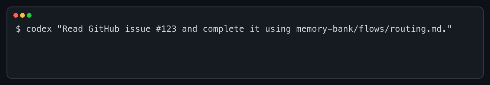

# Memory Bank

<p align="center">
  
</p>

**A version-controlled development system that gives coding agents durable knowledge, explicit governance, and repeatable delivery flows.**

[Русская версия](README.ru.md) · [Quick start (Russian)](docs/quick-start.md) · [Adoption guide](docs/adoption.md) · [Daily usage](docs/usage.md)

**`AGENTS.md` can tell an agent how to start. Memory Bank preserves what the project means, why decisions were made, how work moves from a problem to verified code, and what the next agent needs to know.**

## What it is

Memory Bank combines three parts that reinforce one another:

1. **A project knowledge base** for product, domain, engineering, operations, requirements, and decisions.
2. **A governance layer** that defines who owns each fact, how documents depend on one another, and which source wins when documents disagree.
3. **A delivery system** whose flows turn tasks into governed artifacts, implementation, verification, and new durable knowledge.

Memory Bank is built on the **First Principles Framework (FPF)**. Work starts from explicit facts, constraints, assumptions, and desired outcomes; decisions preserve their rationale and evidence instead of disappearing into a chat session.

It is not a wiki, task tracker, or agent runner. It is the development control plane around those tools: durable context, ownership rules, lifecycle gates, reusable processes, and verification contracts.

Use it when a project has one or more of these symptoms:

- a fresh agent has to reconstruct product intent from chat history;
- the same rule appears in several documents and drifts;
- implementation starts before requirements, risks, or acceptance are clear;
- a task cannot be resumed without the person who ran the previous session;
- a successful test is reported without a durable link to what was verified.

## What you get

- **Durable project context** — product intent, domain language, engineering rules, and operational constraints survive across sessions.
- **A Single Source of Truth** — every canonical fact has one owner; derived documents point back to that source instead of becoming competing copies.
- **Governed delivery** — task routing selects the smallest suitable flow for incidents, bugs, research, small changes, epics, refactoring, or features.
- **Reusable reasoning tools** — artifact templates make the agent state the problem, constraints, selected solution, implementation steps, and verification evidence explicitly.
- **A self-growing knowledge base** — delivery leaves behind decisions, requirements, scenarios, and evidence that future work can reuse.
- **A portable starting point** — an agent brings the template into a repository and adapts it from the project's own evidence.



The result is a feedback loop: project knowledge guides delivery, and delivery improves project knowledge.

## Start with an agent

Copy the prompt that matches the repository. It tells the agent to bring in and
adapt Memory Bank; the linked protocols define the full lifecycle.

### Greenfield

```text
This is a new project. Follow
https://github.com/dapi/memory-bank/blob/main/docs/greenfield-integration-protocol.md.
```

### Brownfield

```text
This is an existing project. Follow
https://github.com/dapi/memory-bank/blob/main/docs/brownfield-adaptation-protocol.md.
```

For reproducible use, replace `main` in a protocol URL with an immutable commit
SHA.

## Deliver a task

After Memory Bank is adapted, give the agent the task and this prompt:

```text
Read the task, ./memory-bank/README.md, and ./memory-bank/flows/routing.md.
Choose the applicable flow and follow its canonical lifecycle. Report the route,
changed artifacts, verification, and open risks.
```

The [daily usage guide](docs/usage.md) explains the task-to-flow-to-verification
cycle and its smaller routes.

## How it works

### DNA and Single Source of Truth

The `dna/` layer is the constitution of the knowledge base. It defines Single Source of Truth, document ownership, dependency direction, lifecycle, frontmatter, and navigation rules. These principles keep Memory Bank internally consistent as it grows.

A canonical document owns a fact. Another document may derive a requirement, plan, or view from it, but must preserve the dependency. When two documents disagree, ownership and dependency direction show which source is authoritative.

### Project knowledge

Stable project context lives in `product/`, `domain/`, `engineering/`, and `ops/`. Research, product initiatives, scenarios, delivery packages, and decisions live in `research/`, `prd/`, `epics/`, `use-cases/`, `features/`, and `adr/`.

Documents own intent, requirements, rationale, and contracts. Code owns implementation. A fresh agent session can therefore resume from the same task and canonical sources without reconstructing the project from chat history.

### Flows and Feature Packs

The `flows/` layer describes repeatable processes that an agent can follow. Every task begins with [Task Routing](template/memory-bank/flows/routing.md), which selects the applicable lifecycle and its evidence requirements.

For a substantial feature, Feature Flow produces a Feature Pack in three stages:

The flow treats the feature as a testable vertical slice and follows
specification-driven development: the documents required by the selected route
are created and reviewed before implementation begins.

```text
brief.md                 design.md                  implementation-plan.md
what and why      →      chosen solution     →     implementation and checks
problem space            solution space             execution space
```

- `brief.md` owns the problem, scope, requirements, and verification contract;
- the Design Pack owns the selected solution, its rationale, and solution-level contracts;
- `implementation-plan.md` owns execution sequencing and checkpoints.

The implementation changes the code, while lasting decisions and evidence return to their canonical owners in Memory Bank. The Feature Pack remains as a durable account of what changed, why it changed, and how the result was verified.

### Templates as reasoning tools

The templates in `flows/templates/` are not merely blank forms. They require an agent to separate the problem, solution, execution, and verification; name assumptions and constraints; compare meaningful alternatives; and preserve traceability. Filling the template therefore improves the decision process as well as its documentation.

## Automation

Memory Bank does not require a runner or CLI, but this repository includes two automation paths:

- the optional [`memory-bank-cli`](docs/memory-bank.md) adds ownership-aware updates, link checks, diagnostics, and downstream CI;
- the experimental [Symphony integration](docs/symphony-github-issues.md) dispatches selected GitHub Issues to Codex in isolated workspaces and hands completed pull requests to human review.

Symphony runs agents and repository work. Memory Bank supplies the knowledge, governance, delivery flows, and verification contracts those agents follow.

## Template layout

This repository is the upstream source. An agent copies the tracked payload in
`template/` into a downstream repository: `template/memory-bank/` becomes
`memory-bank/`, while `template/init.sh` becomes `./init.sh`.

| Area | Purpose |
| --- | --- |
| [`dna/`](template/memory-bank/dna/README.md) | Governance, Single Source of Truth, lifecycle, and document contracts |
| [`product/`](template/memory-bank/product/README.md) | Vision, customers, metrics, marketing, and roadmap |
| [`domain/`](template/memory-bank/domain/README.md) | Glossary, domain model, rules, states, events, and context map |
| [`engineering/`](template/memory-bank/engineering/README.md) | Architecture, testing, coding style, Git workflow, and agent autonomy |
| [`ops/`](template/memory-bank/ops/README.md) | Development, environments, configuration, releases, and runbooks |
| [`research/`](template/memory-bank/research/README.md), [`prd/`](template/memory-bank/prd/README.md), [`epics/`](template/memory-bank/epics/README.md) | Discovery and initiative-level planning |
| [`use-cases/`](template/memory-bank/use-cases/README.md), [`features/`](template/memory-bank/features/README.md), [`adr/`](template/memory-bank/adr/README.md) | Scenarios, delivery packages, and architecture decisions |
| [`flows/`](template/memory-bank/flows/README.md) | Task lifecycles and reusable document templates |

After installation, `memory-bank/README.md` is the primary index inside the downstream project.

## Documentation

- [Quick start (Russian)](docs/quick-start.md)
- [Adopting Memory Bank](docs/adoption.md)
- [Using Memory Bank day to day](docs/usage.md)
- [Context priming for an agent task](docs/context-priming.md)
- [Glossary](docs/glossary.md)
- [Optional CLI automation](docs/memory-bank.md)
- [Symphony with GitHub Issues](docs/symphony-github-issues.md)
- [Ownership and safe updates](docs/ownership.md)
- [Repository development](docs/development.md)
- [Detailed overview in Russian](README.ru.md)

The governance model applies the [MECE principle](https://en.wikipedia.org/wiki/MECE_principle): categories should be mutually exclusive and collectively exhaustive within their declared scope.

The optional CLI for safe updates and automated checks is developed separately
in [`dapi/memory-bank-cli`](https://github.com/dapi/memory-bank-cli). This
template is available under the [Apache License 2.0](LICENSE).
