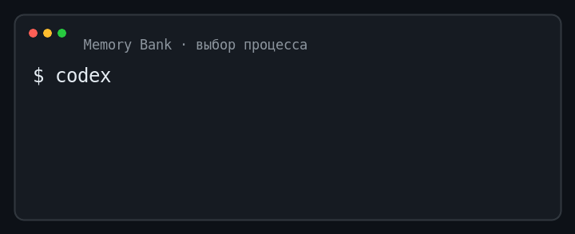

# Memory Bank — система разработки программного обеспечения с ИИ-агентами

**Версионируемая система, которая даёт агентам долговременные знания о проекте, явные правила и повторяемые процессы разработки.**

[English version](README.md) · [Быстрый старт](docs/quick-start.md) · [Внедрение](docs/adoption.md) · [Повседневная работа](docs/usage.md)

**`AGENTS.md` объясняет агенту, как начать. Memory Bank сохраняет смысл проекта, причины принятых решений, путь от задачи до проверенного кода и знания, необходимые следующему агенту.**

## Что это

Memory Bank объединяет три взаимосвязанные части:

1. **Базу знаний проекта** — сведения о продукте, предметной области, инженерии, эксплуатации, требованиях и решениях.
2. **Правила управления знаниями** — кто владеет каждым фактом, как документы зависят друг от друга и какому источнику доверять при противоречии.
3. **Систему процессов разработки** — как превратить задачу в согласованные документы, реализацию, проверку и новые долговременные знания.

В основе Memory Bank лежит **First Principles Framework (FPF), метод мышления от первых принципов**. Работа начинается с явно сформулированных фактов, ограничений, допущений и желаемого результата, а решения сохраняют обоснование и подтверждения вместо того, чтобы исчезнуть вместе с историей чата.

Memory Bank — не вики, не трекер задач и не инструмент запуска агентов. Это управляющий слой разработки вокруг этих инструментов: долговременный контекст, правила владения знаниями, этапы готовности, повторяемые процессы и критерии проверки.

Memory Bank полезен, если в проекте встречается хотя бы одна из этих проблем:

- новый агент вынужден восстанавливать замысел продукта из истории переписки;
- одно правило записано в нескольких документах, и версии начинают расходиться;
- реализация начинается до прояснения требований, рисков и критериев приёмки;
- задачу нельзя продолжить без человека, который вёл предыдущую сессию;
- успешная проверка заявлена, но не связана с тем, что именно проверялось.

## Что вы получаете

- **Долговременный контекст проекта** — замысел продукта, язык предметной области, инженерные правила и эксплуатационные ограничения сохраняются между сессиями.
- **Единственный источник истины** — у каждого канонического факта есть один владелец, а производные документы ссылаются на него, а не создают конкурирующие копии.
- **Управляемую разработку** — маршрутизация выбирает наименьший подходящий процесс для инцидента, дефекта, исследования, небольшой задачи, крупной инициативы, рефакторинга или функционального изменения.
- **Повторяемые инструменты мышления** — шаблоны заставляют явно сформулировать проблему, ограничения, выбранное решение, шаги реализации и подтверждения результата.
- **Самонаполняющуюся базу знаний** — после разработки остаются решения, требования, сценарии и подтверждения, которыми воспользуются следующие задачи.
- **Переносимую точку старта** — агент устанавливает шаблон в репозиторий и адаптирует его по фактам самого проекта.



Так возникает замкнутый цикл: знания проекта направляют разработку, а результаты разработки улучшают знания проекта.

## Начать с агентом

Скопируйте запрос для своего типа проекта. Он поручает агенту установить и
адаптировать Memory Bank; полный жизненный цикл определяют связанные протоколы.

### Новый проект

```text
Это новый проект. Выполни
https://github.com/dapi/memory-bank/blob/main/docs/greenfield-integration-protocol.md.
```

### Существующий проект

```text
Это существующий проект. Выполни
https://github.com/dapi/memory-bank/blob/main/docs/brownfield-adaptation-protocol.md.
```

Для воспроизводимого запуска замените `main` в адресе протокола на неизменяемый
идентификатор коммита.

## Выполнить задачу

После адаптации Memory Bank передайте агенту задачу и этот запрос:

```text
Прочитай задачу, ./memory-bank/README.md и ./memory-bank/flows/routing.md.
Выбери подходящий процесс и следуй его каноническому жизненному циклу. В финале
сообщи выбранный маршрут, изменённые документы, результаты проверок и открытые
риски.
```


[Инструкция по повседневной работе](docs/usage.md) объясняет цикл «задача →
процесс → проверка» и короткие маршруты.

## Как это работает

### ДНК и единственный источник истины

`dna/` — конституция базы знаний. Здесь определены принцип единственного источника истины, владение документами, направление зависимостей, жизненный цикл, метаданные и правила навигации. Эти принципы сохраняют внутреннюю согласованность Memory Bank по мере его роста.

Канонический документ владеет фактом. Другой документ может вывести из него требование, план или представление, но обязан сохранить зависимость от источника. Если документы противоречат друг другу, правила владения и направление зависимостей показывают, какой источник является авторитетным.

### Знания о проекте

Постоянный контекст проекта находится в `product/`, `domain/`, `engineering/` и `ops/`. Исследования, продуктовые инициативы, сценарии, комплекты документов разработки и решения находятся в `research/`, `prd/`, `epics/`, `use-cases/`, `features/` и `adr/`.

Документы владеют замыслом, требованиями, обоснованием решений и контрактами. Код владеет реализацией. Поэтому новую сессию агента можно начать с той же задачи и канонических источников, не восстанавливая проект из истории переписки.

### Процессы и Feature Pack

В `flows/` описаны повторяемые процессы, которым может следовать агент. Каждая задача начинается с [маршрутизации](template/memory-bank/flows/routing.md): она выбирает подходящий жизненный цикл и необходимые подтверждения.

Для значимого функционального изменения процесс Feature Flow создаёт Feature Pack — комплект документов фичи, который проходит три стадии:

Процесс рассматривает функциональное изменение как проверяемый вертикальный
срез и следует разработке на основе спецификации: предусмотренные
выбранным маршрутом документы создаются и проходят проверку до начала
реализации.

```text
brief.md                 design.md                  implementation-plan.md
что и зачем       →      выбранное решение   →     реализация и проверки
пространство задачи      пространство решения      пространство исполнения
```

- `brief.md` владеет проблемой, границами, требованиями и критериями проверки;
- дизайн-пакет владеет выбранным решением, его обоснованием и контрактами решения;
- `implementation-plan.md` владеет порядком реализации и контрольными точками.

Реализация изменяет код, а долговременные решения и подтверждения возвращаются к своим каноническим владельцам в Memory Bank. Feature Pack остаётся описанием того, что изменилось, почему это изменилось и как был проверен результат.

### Шаблоны как инструменты мышления

Шаблоны в `flows/templates/` — не пустые бланки. Они требуют от агента разделить задачу, решение, исполнение и проверку; назвать допущения и ограничения; сравнить значимые варианты; сохранить прослеживаемость. Поэтому заполнение шаблона улучшает не только документацию, но и сам процесс принятия решения.

## Автоматизация

Для базовой работы Memory Bank не требует отдельного инструмента запуска или командной утилиты, но этот репозиторий содержит два направления автоматизации:

- необязательная утилита [`memory-bank-cli`](docs/memory-bank.md) добавляет безопасные обновления с учётом владельцев, проверку ссылок, диагностику и проверки в непрерывной интеграции;
- экспериментальная [интеграция с Symphony](docs/symphony-github-issues.md) передаёт выбранные задачи GitHub агенту Codex в изолированных рабочих директориях, а готовые запросы на слияние направляет человеку на проверку.

Symphony запускает агентов и работу с репозиторием. Memory Bank предоставляет знания, правила, процессы разработки и критерии проверки, которым следуют эти агенты.

## Что находится в шаблоне

В этом исходном репозитории содержимое шаблона хранится в `template/`. Агент
переносит файлы, отслеживаемые Git, из этой директории в корень проекта-получателя:
например, `template/memory-bank/` становится `memory-bank/`, а
`template/init.sh` — `./init.sh`.

| Директория | Назначение |
| --- | --- |
| [`dna/`](template/memory-bank/dna/README.md) | Правила управления: единственный источник истины, метаданные, жизненный цикл и связи между документами |
| [`product/`](template/memory-bank/product/README.md) | Замысел продукта, пользователи, показатели, продвижение и дорожная карта |
| [`domain/`](template/memory-bank/domain/README.md) | Словарь, модель предметной области, правила, состояния, события и границы контекстов |
| [`engineering/`](template/memory-bank/engineering/README.md) | Архитектура, тестирование, стиль кода, работа с Git и границы самостоятельности агента |
| [`ops/`](template/memory-bank/ops/README.md) | Локальная разработка, окружения, конфигурация, выпуски и операционные инструкции |
| [`research/`](template/memory-bank/research/README.md), [`prd/`](template/memory-bank/prd/README.md), [`epics/`](template/memory-bank/epics/README.md) | Исследования и планирование инициатив |
| [`use-cases/`](template/memory-bank/use-cases/README.md), [`features/`](template/memory-bank/features/README.md), [`adr/`](template/memory-bank/adr/README.md) | Сценарии, комплекты документов разработки и архитектурные решения |
| [`flows/`](template/memory-bank/flows/README.md) | Жизненные циклы задач и повторно используемые шаблоны документов |

После установки [`memory-bank/README.md`](template/memory-bank/README.md) становится основным указателем внутри проекта-получателя.

Корневой [`template/init.sh`](template/init.sh) — переносимый сценарий начальной
настройки для `mise`, вложенных репозиториев Git и `direnv`, если соответствующие
файлы есть в проекте. После установки адаптируйте `./init.sh` под реальные
команды установки зависимостей, подготовки базы данных и запуска служб; сценарий
намеренно не переносит файлы `.env`.

## Внедрение в проект

В проект-получатель устанавливаются директория `memory-bank/` и сценарий
`init.sh`. Исходники командной утилиты, модуль Go, непрерывная интеграция и
настройки выпуска этого репозитория не входят в шаблон приложения. Безопасные
автоматические обновления и проверки — необязательное расширение, а не условие
базового внедрения.

Инструкция по внедрению охватывает:

- адаптацию существующего проекта;
- запуск нового проекта;
- настройку агента;
- локальную проверку и проверки проекта-получателя в непрерывной интеграции.

Следуйте [инструкции по внедрению](docs/adoption.md).

## Выбор рабочего процесса

Каждая задача сначала проходит [маршрутизацию](template/memory-bank/flows/routing.md). Она направляет работу в процесс обработки инцидента, исправления дефекта, исследования, небольшого изменения, крупной инициативы, рефакторинга или функционального изменения либо передаёт выбор человеку.

Корневой README даёт только обзор. Условия входа, жизненные циклы, обязательные документы и критерии завершения принадлежат каноническим документам в [`memory-bank/flows/`](template/memory-bank/flows/README.md) и не дублируются здесь.

## Документация репозитория

| Документ | Для кого и зачем |
| --- | --- |
| [Быстрый старт](docs/quick-start.md) | Для установки Memory Bank и запуска первой реальной задачи через Codex |
| [Внедрение Memory Bank](docs/adoption.md) | Для команд, подключающих шаблон к существующему или новому проекту |
| [Протокол адаптации существующего проекта](docs/brownfield-adaptation-protocol.md) | Для основанной на фактах адаптации репозитория до и после установки Memory Bank |
| [Протокол создания нового проекта](docs/greenfield-integration-protocol.md) | Для копирования шаблона, извлечения фактов из README и документации, адаптации Memory Bank и создания исходного описания продукта |
| [Использование Memory Bank](docs/usage.md) | Для повседневной работы с задачами и ИИ-агентами после внедрения |
| [Подготовка контекста](docs/context-priming.md) | Для подготовки ИИ-агента к конкретной задаче и сбора уместного контекста |
| [Пользовательские истории, варианты использования и BDD-сценарии](docs/bdd-user-stories-and-use-cases.md) | Для разделения устойчивого сценария, поставляемой части функции и проверяемых примеров поведения |
| [Необязательная автоматизация через CLI](docs/memory-bank.md) | Для безопасных обновлений и проверок проекта-получателя в непрерывной интеграции |
| [Symphony и задачи GitHub](docs/symphony-github-issues.md) | Для автоматического запуска Codex по выбранным задачам GitHub |
| [Словарь](docs/glossary.md) | Для терминов управления знаниями и структуры документации |
| [Владение и безопасные обновления](docs/ownership.md) | Для понимания схемы блокировки, границ владения и правил разрешения конфликтов |
| [Управляемый блок инструкций агента](docs/agent-instructions.md) | Для служебных меток, диагностики и выбора единственного файла инструкций агента |
| [Разработка репозитория](docs/development.md) | Для разработчиков шаблона |

Необязательная утилита `memory-bank-cli` добавляет безопасные обновления,
проверку ссылок и диагностику правил. Она разрабатывается и выпускается отдельно
в [`dapi/memory-bank-cli`](https://github.com/dapi/memory-bank-cli).

## Развитие шаблона

### Методические основания

- **First Principles Framework (FPF)** — основание для принятия решений от явных фактов, ограничений и проверяемых следствий;
- [принцип MECE](https://en.wikipedia.org/wiki/MECE_principle) — непересекающиеся категории, которые вместе покрывают заявленную область;
- Dan North, [*Introducing BDD*](https://dannorth.net/blog/introducing-bdd/) — первичный источник разработки через поведение: уточнение требований через ценность для бизнеса, конкретные примеры и исполняемые сценарии приёмки в форме `Given / When / Then`;
- Philippe Kruchten, [*Architectural Blueprints — The “4+1” View Model of Software Architecture*](https://arxiv.org/abs/2006.04975) — первичный источник проверки архитектуры через логическое представление, процессы, разработку и физическое размещение, связанные ключевыми сценариями; [краткий обзор](https://en.wikipedia.org/wiki/4%2B1_architectural_view_model);
- Nenad Medvidovic, Richard N. Taylor, [*A Classification and Comparison Framework for Software Architecture Description Languages*](https://ics.uci.edu/~taylor/documents/2000-ADLs-TSE.pdf) — источник архитектурной модели компонентов, связей и конфигураций.

### Проекты, в которых развивается практика

Эти репозитории используют и адаптируют Memory Bank под конкретные проекты.
Опыт их эксплуатации может становиться источником обобщаемых правил для
шаблона, но сведения о конкретном проекте остаются в его собственной копии
Memory Bank.

- [`dapi/zelma`](https://github.com/dapi/zelma);
- [`brandymint/merchantly`](https://github.com/brandymint/merchantly);
- [`alfagen/mercury`](https://github.com/alfagen/mercury).

Добавляйте в шаблон только обобщаемые правила. Названия продуктов,
инфраструктурные подробности и другие сведения о конкретном проекте должны
оставаться в его собственной копии `memory-bank/`.
