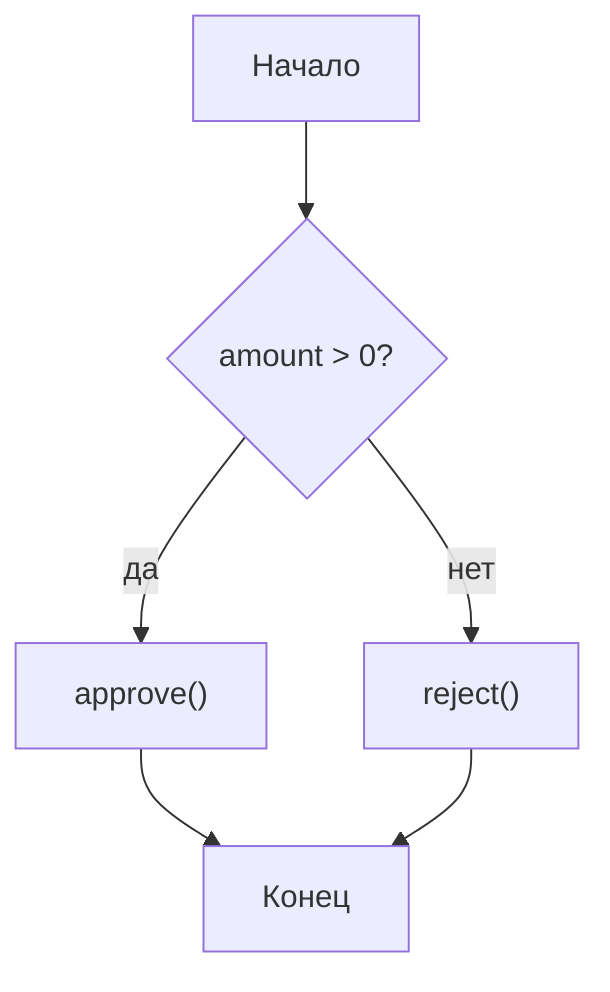
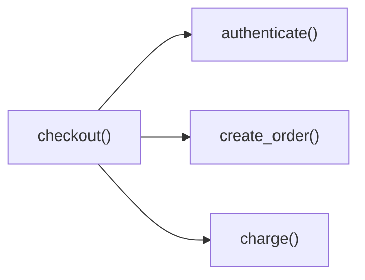
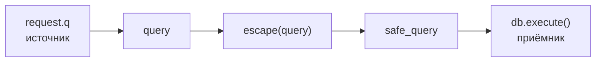
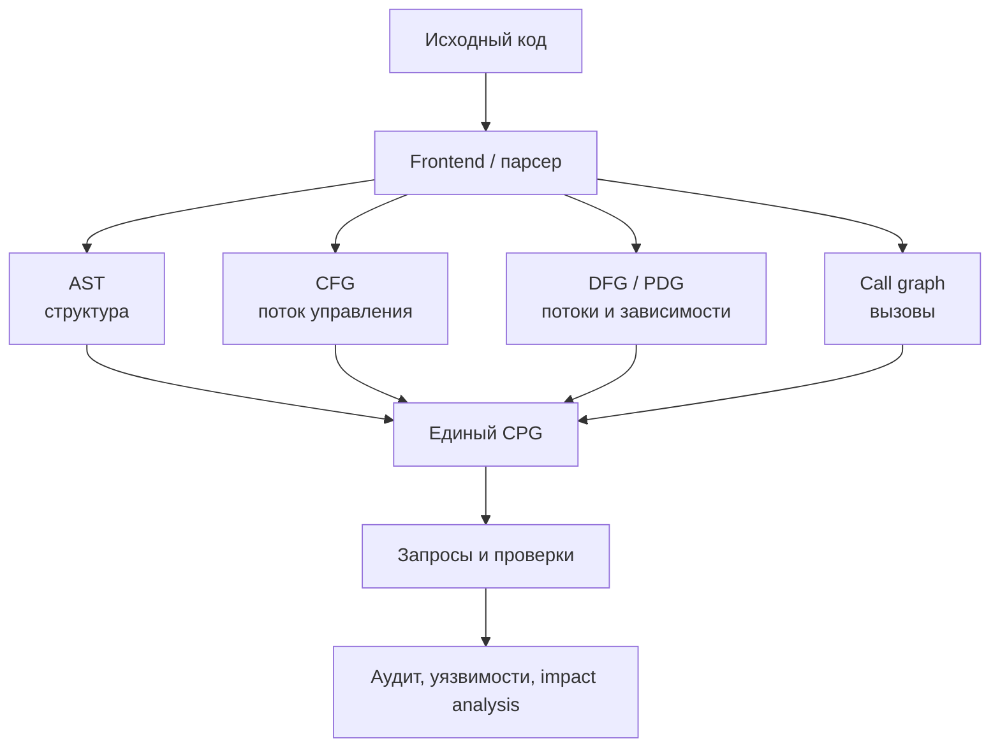

# Code Property Graph: как видеть код не строками, а связями

## Зачем тебе вообще разбираться в графах кода

Code Property Graph (CPG) служит основой для технического и структурного аудита кода. Эта модель особенно полезна в агентной разработке: агенту недостаточно знать, что в репозитории есть функция `process_payment`. Нужно понимать:

- кто её вызывает;
- какие данные в неё попадают;
- при каких условиях она выполняется;
- какие модули от неё зависят;
- какие тесты и артефакты могут быть затронуты изменением.

Обычный поиск по тексту отвечает на вопрос «где встречается это слово». CPG позволяет задавать вопросы другого уровня: «может ли пользовательский ввод пройти через несколько функций и попасть в SQL-запрос без очистки?» или «может ли модуль заказов напрямую вызвать инфраструктурный модуль, минуя доменный слой?»

CPG объединяет несколько представлений: абстрактное синтаксическое дерево, граф потока управления, граф потоков данных, граф вызовов и графы зависимостей. Классическая модель CPG объединяет AST, CFG и PDG; современные реализации добавляют вызовы, типы, межпроцедурные связи и другие слои. Поэтому CPG — не один конкретный рисунок и не универсальный стандарт во всех инструментах, а схема объединения свойств программы в единую графовую модель.

## 1. Что такое граф в программном коде

Граф — это набор узлов и связей между ними.

В графе кода узлами могут быть:

- файл, модуль, класс или функция;
- объявление переменной;
- условие `if`;
- вызов функции;
- литерал, например строка или число;
- оператор присваивания или арифметики.

Связи отвечают на разные вопросы:

- `AST`: из каких частей состоит конструкция;
- `CFG`: каким путём может идти выполнение;
- `CALL`: какая функция какую вызывает;
- `DATA_FLOW`: как значение перемещается от источника к потребителю;
- `DEPENDENCY`: что от чего зависит.

Один и тот же фрагмент кода может одновременно иметь все эти связи. В этом и состоит сила CPG: вместо нескольких разрозненных инструментов получается единая карта, по которой можно переходить от синтаксиса к исполнению и данным.

## 2. AST — дерево синтаксиса

AST, Abstract Syntax Tree, — абстрактное синтаксическое дерево. Оно показывает структуру программы, отбрасывая несущественные для анализа детали вроде пробелов и большинства комментариев.

Рассмотрим код:

```python
total = price * quantity
```

Его упрощённое AST выглядит так:

```text
Assignment
├── Name: total
└── Multiply
    ├── Name: price
    └── Name: quantity
```

AST отвечает на вопросы:

- является ли выражение присваиванием или вызовом;
- какие аргументы переданы функции;
- находится ли вызов внутри `if`, цикла или обработчика исключений;
- какие операторы и литералы используются;
- какие конструкции нужно изменить при рефакторинге.

AST — один из компонентов Code Property Graph. При этом AST может быть конкретным для языка: дерево Python отличается от дерева JavaScript или C++. Чтобы объединять разные языки, CPG обычно использует нормализованные типы узлов и сохраняет языково-специфические детали в свойствах.

Главное ограничение AST: он показывает форму кода, но сам по себе почти не показывает, в каком порядке выполняются ветки и как значения проходят через программу.

## 3. CFG — граф потока управления

CFG, Control Flow Graph, показывает возможные пути выполнения программы. Узлыми обычно являются инструкции или базовые блоки, а рёбрами — переходы управления.

```python
if amount > 0:
    approve()
else:
    reject()
```

Упрощённый CFG:



CFG помогает искать:

- недостижимый код;
- ветки без обработки;
- бесконечные циклы;
- возможные пути к опасной операции;
- нарушения архитектурного процесса.

Важно не путать CFG с графом вызовов. CFG показывает переходы внутри выполнения программы, а граф вызовов — отношения между функциями. Вызов `approve()` является одним узлом или участком CFG, но одновременно создаёт связь в call graph к функции `approve`.

## 4. Граф вызовов

Call Graph — ориентированный граф, где узлы — функции или методы, а ребро `A → B` означает, что `A` может вызвать `B`.

```python
def checkout(request):
    user = authenticate(request)
    order = create_order(user)
    return charge(order)
```



Такой граф позволяет понять:

- что будет затронуто изменением функции;
- какие функции являются точками входа;
- где находятся центральные узлы с большим числом зависимых вызовов;
- есть ли циклические вызовы;
- какие участки системы требуют интеграционных тестов.

Но call graph обычно является приближением. Для динамического вызова, полиморфизма, рефлексии, dependency injection и вызовов через конфигурацию статический анализ может построить несколько возможных рёбер или не восстановить связь полностью. Поэтому формулировка «может вызвать» точнее, чем «всегда вызывает».

## 5. Граф потоков данных

Data-flow graph показывает, как конкретное значение перемещается и преобразуется в программе.

```python
query = request.get("q")
safe_query = escape(query)
result = db.execute(safe_query)
```



Здесь важна не только структура вызовов. Вопрос звучит так: дошло ли значение из `request.q` до `db.execute`, и прошло ли оно через `escape`?

Data flow используется для:

- поиска SQL-инъекций, command injection и XSS;
- отслеживания персональных данных;
- анализа источников и приёмников секретов;
- проверки, что данные прошли валидацию;
- построения impact analysis: какие места получают значение из изменённого источника.

Граф потока данных может быть локальным, внутри одной функции, или глобальным/межпроцедурным — через границы функций и файлов. В CodeQL, например, узлы data-flow graph могут соответствовать AST-узлам, но это не одно и то же: поток данных — отдельное аналитическое представление поверх элементов программы.

## 6. Что такое граф зависимостей

Слово «зависимость» используют для нескольких разных графов. Их стоит разделять.

### Зависимость данных

Она означает, что результат одной операции нужен другой:

```python
x = read_input()
y = normalize(x)
save(y)
```

В цепочке `read_input → normalize → save` есть зависимость по данным: `save` не может корректно использовать `y`, пока не будет вычислен `normalize(x)`.

### Зависимость управления

Одна операция выполняется только потому, что условие разрешило её выполнение:

```python
if is_admin(user):
    delete_account(user)
```

Вызов `delete_account` зависит от условия `is_admin(user)`. Это не поток значения `user` как таковой, а контрольный контекст.

### Архитектурная или модульная зависимость

Модуль `orders` импортирует `payments`, класс зависит от интерфейса, сервис зависит от базы данных или пакет зависит от библиотеки. Это уже уровень архитектуры и сборки, а не отдельного выражения.

На практике архитектурные связи, дополненные call graph и структурой CPG, позволяют проверять запреты прямого вызова из модуля A в модуль B и обнаруживать циклы. Такой слой можно использовать для проверки правил:

```text
web -> application -> domain -> infrastructure

Запрещено:
domain -> web
domain -> infrastructure напрямую
```

CPG хорош тем, что способен связать эти уровни: от функции и её AST-узлов — к вызовам, типам, файлу и модулю.

## 7. Что именно означает Code Property Graph

Code Property Graph — ориентированный, размеченный и атрибутированный мультиграф.

- Ориентированный: у ребра есть направление.
- Размеченный: ребро имеет тип — например, AST, CALL или REACHING_DEF.
- Атрибутированный: у узла и ребра есть свойства — имя, тип, код, строка файла, сигнатура и так далее.
- Мультиграф: между двумя узлами может быть несколько рёбер разных типов.

Идея первоначальной научной работы Yamaguchi и соавторов 2014 года — объединить AST, CFG и program dependence graph в одну структуру, чтобы искать уязвимости графовыми обходами. Современная спецификация Joern описывает CPG как языконезависимое промежуточное представление для запросов к коду.

Упрощённо CPG можно представить так:



Существенная мысль: CPG — не обязательно граф, который нужно рисовать целиком на экране. Реальный граф большого репозитория будет огромным. Ценность — в том, что инструмент может выполнить ограниченный запрос и вернуть небольшой объяснимый путь: источник → преобразования → приёмник, или caller → callee → следующий callee.

## 8. Как несколько графов отвечают на один вопрос

Возьмём архитектурное правило: «код домена не должен напрямую обращаться к базе данных».

Один AST не даст полного ответа. Он может показать импорт `db` или вызов метода, но не всегда раскроет смысл зависимости.

Комбинация представлений выглядит так:

1. AST находит вызов `db.query(...)` внутри функции доменного слоя.
2. Call graph показывает, кто вызывает эту функцию и какие альтернативные пути существуют.
3. Dependency graph связывает файл с модулем `domain` и пакет с модулем `infrastructure`.
4. CFG показывает, при каких условиях происходит обращение к базе.
5. Data-flow graph показывает, какие параметры попадают в запрос.
6. CPG-запрос объединяет все условия и выдаёт нарушение с путём до конкретной строки.

Тот же принцип работает для безопасности:

```text
HTTP-параметр
  --data flow--> строка запроса
  --call graph--> db.execute
  --AST--> вызов без sanitizer
  --CFG--> достижимая ветка
  => потенциальная SQL-инъекция
```

И для архитектуры:

```text
domain.OrderService
  --CALL--> persistence.Database
  --module dependency--> infrastructure
  --AST--> прямой импорт
  => нарушение правила слоёв
```

## 9. Что можно проверять автоматически

Из CPG можно строить проверки нескольких классов.

### Структурные проверки

- запрещённые импорты;
- вызовы конкретных API;
- наличие или отсутствие аннотаций;
- соблюдение шаблона реализации;
- циклы между пакетами.

### Проверки потока

- пользовательский ввод до опасного sink;
- секрет из хранилища до логгера;
- персональные данные до внешнего API;
- значение, которое читается до инициализации.

### Проверки архитектуры

- обход слоёв;
- слишком сильная связанность модулей;
- недопустимые направления зависимостей;
- чрезмерно центральные функции;
- изменение публичного интерфейса с большим blast radius.

### Проверки процесса разработки

Именно здесь появляется связь CPG с цифровыми ролями. CPG описывает техническую сторону: что существует в коде и как связано. Поверх него можно строить роли и проверки:

- архитектор формулирует правило зависимости;
- разработчик меняет код;
- автоматический анализ проверяет CPG;
- ревьюер получает не весь репозиторий, а найденный путь нарушения;
- тестировщик получает список затронутых функций и модулей.

Важно: CPG не заменяет бизнес-требования. Он способен проверить, как написан код и какие технические связи в нём существуют, но не доказывает, что функция действительно реализует нужную бизнес-логику.

## 10. Минимальный практический пример запроса

В Joern доступ к графу начинается с объекта `cpg`. Например, концептуально можно запросить методы, содержащие вызов `execute`:

```scala
cpg.method
  .call
  .name("execute")
  .method
  .fullName
  .l
```

Или исследовать AST конкретного метода:

```scala
cpg.method.name("checkout").ast.l
```

Синтаксис и доступные шаги зависят от версии инструмента и языка, но логика одна: мы не читаем файлы линейно, а перемещаемся по типизированным узлам и рёбрам.

Для агентной системы поверх CPG были бы полезны запросы такого вида:

```text
Найди все функции, которые:
1. принадлежат модулю domain;
2. вызывают infrastructure напрямую;
3. доступны из публичного HTTP-входа;
4. не покрыты тестом, который проходит через этот путь.
```

Это уже не обычный grep. Это композиция условий на структуру, вызовы, достижимость и зависимости.

## 11. Ограничения и источники ложной уверенности

CPG — мощное представление, но не магическая модель понимания программы.

### Неполный анализ языка

Если frontend неправильно разобрал код, граф будет неполным. Макросы, генерация кода, динамические языки и нестандартные сборочные шаги усложняют построение связей.

### Динамическое поведение

Рефлексия, `eval`, динамические импорты и dependency injection могут сделать точный call graph невозможным. Анализ обычно строит множество возможных путей, чтобы не пропустить опасный, но это увеличивает false positives.

### Семантика бизнеса

Граф знает, что `charge(order)` вызывается после `create_order`. Он не знает сам по себе, разрешено ли списывать деньги в конкретном бизнес-сценарии.

### Масштаб

Полный CPG большого репозитория слишком велик для передачи в контекст LLM. Агенту нужно давать не весь граф, а запросы и компактные объяснения путей: узлы, типы рёбер, строки исходников и доказательства результата.

### Стоимость актуализации

Граф нужно перестраивать или обновлять после изменений. Иначе агент будет рассуждать по устаревшей карте кода.

## 12. Какую модель стоит держать в голове

Запомни простую формулу:

```text
AST = из чего состоит код
CFG = как может идти выполнение
Call graph = кто кого вызывает
Data flow = куда движутся значения
Dependency graph = от чего зависит компонент
CPG = все эти свойства, связанные в одной модели
```

И ещё одна, более практичная:

```text
Текстовый поиск находит совпадения.
AST понимает структуру.
Графы понимают отношения.
CPG позволяет задавать составные вопросы об отношениях.
```

В контексте агентной разработки это превращает репозиторий из набора файлов в проверяемую среду. Агент может не просто предложить изменение, а проверить его по карте вызовов, потоков данных, зависимостей и архитектурных правил. Но окончательное доказательство корректности всё равно требует тестов, ревью и проверки бизнес-смысла.

## Источники

- [Встреча «Управление сложностью кода через Code Property Graph и цифровые роли»](https://app.mymeet.ai/ru/public-meetings/ab134fa3-e164-4e5a-89f0-c8530cfde37d) — практический контекст применения CPG в агентной разработке.
- [Yamaguchi et al., “Modeling and Discovering Vulnerabilities with Code Property Graphs”](https://www.ieee-security.org/TC/SP2014/papers/ModelingandDiscoveringVulnerabilitieswithCodePropertyGraphs.pdf) — исходная научная работа о CPG.
- [Joern: Code Property Graph](https://docs.joern.io/code-property-graph/) — современное практическое описание CPG.
- [Code Property Graph Specification](https://cpg.joern.io/) — схема узлов, свойств и рёбер.
- [Joern: Syntax-Tree Queries](https://docs.joern.io/c-syntaxtree/) — примеры работы с AST в CPG.
- [LLVM: Dependence Graphs](https://www.llvm.org/docs/DependenceGraphs/index.html) — справка о графах зависимостей данных.
- [CodeQL: Data Flow for JavaScript and TypeScript](https://codeql.github.com/docs/codeql-language-guides/analyzing-data-flow-in-javascript-and-typescript/) — пример отдельной модели потоков данных и её связи с AST.
