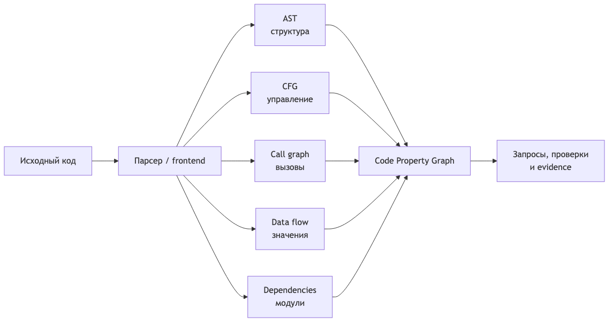

# Почему grep недостаточно AI-агенту: Code Property Graph простыми словами

Когда AI-агент меняет большой репозиторий, ему недостаточно найти функцию по имени.

Допустим, агент увидел `process_payment`. Чтобы безопасно изменить её, нужно понять:

- кто её вызывает;
- какие данные в неё попадают;
- при каких условиях выполняется вызов;
- какие модули от неё зависят;
- какие тесты проходят через этот путь;
- не нарушит ли изменение архитектурные границы.

Текстовый поиск отвечает: «где встречается эта строка?»

Code Property Graph позволяет задавать другой класс вопросов: «может ли пользовательский ввод пройти через три функции и попасть в опасный SQL-вызов?» или «может ли доменный модуль обратиться к базе данных в обход application layer?»



## Сначала — что такое граф кода

Граф состоит из узлов и связей.

В коде узлами могут быть файл, функция, переменная, условие, вызов или литерал. Связи объясняют, как эти элементы относятся друг к другу.

Один и тот же фрагмент программы можно рассматривать сразу в нескольких представлениях:

```text
AST              — из чего состоит код
CFG              — по каким путям идёт выполнение
Call graph       — кто кого вызывает
Data flow        — куда движутся значения
Dependency graph — от чего зависит компонент
```

Code Property Graph, или CPG, связывает эти представления в одну модель.

## AST: форма кода

Возьмём выражение:

```python
total = price * quantity
```

Упрощённое абстрактное синтаксическое дерево выглядит так:

```text
Assignment
├── Name: total
└── Multiply
    ├── Name: price
    └── Name: quantity
```

AST позволяет увидеть, что перед нами присваивание, внутри которого находится умножение двух имён. Оно помогает искать конкретные конструкции, аргументы вызова, операторы и вложенность.

Но AST почти ничего не говорит о том, какая ветка выполнится и откуда пришли значения `price` и `quantity`.

## CFG: возможные пути выполнения

Control Flow Graph показывает переходы управления:

```python
if amount > 0:
    approve()
else:
    reject()
```

В графе появится условие и две возможные ветки. Это позволяет находить недостижимый код, пропущенную обработку ошибок и пути к опасной операции.

Важно: CFG — не граф вызовов. CFG показывает порядок и ветвление исполнения, а call graph связывает функции.

## Call graph: кто кого вызывает

```python
def checkout(request):
    user = authenticate(request)
    order = create_order(user)
    return charge(order)
```

Call graph добавит связи:

```text
checkout → authenticate
checkout → create_order
checkout → charge
```

По такому графу можно оценить область влияния изменения, найти точки входа, циклические вызовы и центральные функции.

Однако статический call graph всегда является приближением. Полиморфизм, dependency injection, рефлексия и динамические импорты могут породить несколько возможных целей вызова или скрыть часть связей. Поэтому точнее говорить «функция может вызвать», а не «всегда вызывает».

## Data flow: куда движется конкретное значение

Рассмотрим небезопасный код:

```python
query = request.get("q")
sql = "SELECT * FROM products WHERE name = '" + query + "'"
result = db.execute(sql)
```

Нас интересует путь значения:

```text
HTTP-параметр q
→ query
→ конкатенация SQL-строки
→ sql
→ db.execute
```

Data-flow анализ может связать источник пользовательских данных с опасным приёмником. После этого код можно исправить параметризованным запросом:

```python
query = request.get("q")
result = db.execute(
    "SELECT * FROM products WHERE name = ?",
    (query,),
)
```

Такой анализ используют для поиска injection-уязвимостей, утечек секретов, передачи персональных данных и нарушений обязательной валидации.

## Dependency graph: архитектурные границы

На уровне модулей нас интересуют связи другого масштаба:

```text
web → application → domain
                  → infrastructure
```

Если `domain` напрямую импортирует драйвер базы данных, одного поиска по слову `db` может быть недостаточно. Вызов может быть спрятан за обёрткой или интерфейсом.

Комбинация AST, call graph и модульных связей позволяет проверять правила вроде:

- доменный слой не зависит от web;
- доступ к базе идёт только через разрешённый порт;
- публичный HTTP-handler не вызывает infrastructure в обход application layer;
- между пакетами нет циклов.

## Что именно объединяет CPG

Классическая работа по Code Property Graph объединила три представления: AST, Control Flow Graph и Program Dependence Graph. Современные реализации обычно добавляют вызовы, типы, межпроцедурные связи и другие слои.

Технически CPG — ориентированный размеченный граф со свойствами:

- у узлов есть тип, имя, код, файл и позиция;
- у рёбер есть направление и тип связи;
- между двумя узлами могут существовать разные связи одновременно.

Например, один вызов может одновременно:

- быть дочерним узлом AST функции;
- находиться на определённом пути CFG;
- иметь ребро `CALL` к другой функции;
- участвовать в data-flow пути;
- принадлежать модулю с архитектурными ограничениями.

CPG не нужно целиком рисовать на экране. Граф большого репозитория будет слишком велик. Практическая ценность появляется, когда запрос возвращает небольшой объяснимый путь и строки исходного кода.

## Как несколько графов отвечают на один вопрос

Возьмём правило: «код домена не должен напрямую обращаться к базе данных».

Проверка может выглядеть так:

1. AST находит вызов метода доступа к данным.
2. Call graph восстанавливает цепочку вызовов.
3. Модульный граф определяет принадлежность вызывающей функции к `domain`.
4. CFG проверяет, достижим ли этот вызов.
5. Data flow показывает, какие значения попадают в запрос.
6. CPG-запрос возвращает путь до конкретных строк как доказательство нарушения.

Именно композиция отличает CPG от продвинутого grep.

## Зачем это AI-агенту

Большая языковая модель хорошо объясняет найденный фрагмент, но плохо заменяет детерминированный анализ всего репозитория. Даже большое контекстное окно не гарантирует, что в него попали все косвенные вызовы и архитектурные связи.

Я вижу полезное разделение труда:

1. CPG или статический анализ строит карту и выполняет точный запрос.
2. Агент получает не весь граф, а компактный путь с типами связей и строками кода.
3. LLM объясняет риск, предлагает изменение и формирует план.
4. После изменения анализ запускается повторно.
5. Тесты и ревью подтверждают поведение и бизнес-смысл.

Так агент не просто предполагает, что изменение безопасно, а опирается на воспроизводимые технические доказательства.

## Что CPG не умеет

Важно не превратить CPG в новую магию.

Граф может быть неполным из-за динамических вызовов, генерации кода, макросов или особенностей языка. Межпроцедурный анализ дорог, а устаревший граф опасен. Статический анализ также не знает бизнес-смысла операции.

CPG способен показать, что `charge(order)` вызывается после `create_order`. Но он не докажет, что списание денег разрешено в конкретном пользовательском сценарии.

Поэтому нужны два разных слоя доказательств:

```text
Code graph:
как устроен код и какие технические правила он нарушает

Evidence graph:
какое требование реализовано, каким тестом проверено и где результат
```

## Модель, которую стоит запомнить

```text
Текстовый поиск находит совпадения.
AST понимает структуру.
Графы понимают отношения.
CPG позволяет задавать составные вопросы об отношениях.
```

Для агентной разработки это важный переход. Репозиторий перестаёт быть набором файлов, которые модель по очереди читает. Он становится проверяемой картой структуры, вызовов, потоков данных и зависимостей.

Но финальное доказательство корректности всё равно дают не графы сами по себе, а их сочетание с тестами, требованиями, ревью и работающим кодом.

Полная версия и дополнительные примеры: **[заменить на URL статьи на pismenny.ru]**

Источники: [исходная работа о CPG](https://www.ieee-security.org/TC/SP2014/papers/ModelingandDiscoveringVulnerabilitieswithCodePropertyGraphs.pdf), [документация Joern](https://docs.joern.io/code-property-graph/), [встреча о CPG и цифровых ролях](https://app.mymeet.ai/ru/public-meetings/ab134fa3-e164-4e5a-89f0-c8530cfde37d).
