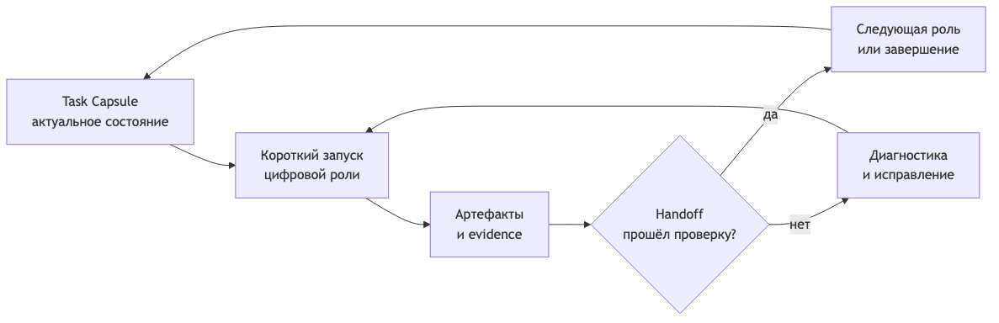

# «Бесконечная» сессия AI-агента — это не бесконечный контекст

Когда AI-агент работает над задачей несколько часов или дней, первая идея кажется очевидной: нужно дать ему больше контекста и не завершать диалог.

Но длинный чат плохо превращается в надёжный производственный процесс. Контекст разрастается, важные ограничения теряются среди старых сообщений, модель начинает противоречить собственным решениям, а после сбоя работу трудно воспроизвести.

Я всё больше прихожу к другому выводу: агенту нужна не бесконечная память разговора, а долговечное состояние задачи.

Эта мысль особенно чётко прозвучала у меня после встречи с Михаилом о цифровых ролях, оркестрации и Code Property Graph. Ниже я отделяю услышанную концепцию от своей прикладной интерпретации для разработки с Memory Bank.



## Сессия должна заканчиваться. Задача — нет

Под «бесконечной сессией» я понимаю последовательность коротких запусков:

```text
прочитать состояние задачи
→ выполнить один ограниченный шаг
→ записать артефакты и доказательства
→ проверить результат
→ передать задачу следующей роли
```

Каждый запуск может использовать новую модель, новый контекст и даже другого исполнителя. Их объединяет не история чата, а идентификатор задачи и сохранённое состояние.

Такой процесс переживает:

- исчерпание контекстного окна;
- compact и потерю части диалога;
- падение модели или инструмента;
- паузу между рабочими сессиями;
- смену модели, агента или человека;
- повторный запуск после неудачной проверки.

Если для продолжения обязательно нужен весь предыдущий разговор, процесс остаётся хрупким. Если достаточно прочитать несколько актуальных документов и состояние задачи, процесс становится возобновляемым.

## Что именно нужно сохранять

Я называю такой пакет состояния Task Capsule — капсулой задачи. Название вторично; важен состав.

Минимальная капсула отвечает на вопросы:

- какую задачу мы решаем;
- на какой стадии находимся;
- какая роль сейчас выполняет работу;
- какие решения уже приняты;
- где лежат актуальные артефакты;
- какие риски и блокировки открыты;
- что должно произойти дальше;
- при каких условиях работу нужно остановить.

Например:

```yaml
task_id: FT-042
stage: implementation
current_role: implementer
next_role: verifier
status: active
artifacts:
  brief: features/FT-042/brief.md
  design: features/FT-042/design.md
  plan: features/FT-042/implementation-plan.md
open_risks:
  - missing_negative_scenario
next_action: Implement STEP-03
stop_conditions:
  - plan and code contract diverge
  - required test evidence missing
```

Это намного компактнее полного чата. И, что важнее, это можно проверить машиной.

## Цифровая роль — не персонаж, а контракт

В обсуждаемом подходе роль — не «агент-архитектор с характером». Это ограниченный пакет:

- инструкция;
- разрешённые инструменты;
- входной контракт;
- ожидаемые артефакты;
- границы изменений;
- критерии завершения;
- допустимый следующий переход.

Например, разработчик получает brief, design и implementation plan, а вернуть должен изменения кода, результаты тестов и evidence log. Он не может молча изменить требования: для этого нужен возврат на предыдущую стадию.

LLM выполняет работу внутри шага, но не владеет всем процессом. Переходами владеет workflow.

## Workflow важнее промпта

Хороший промпт помогает роли выполнить шаг. Но он не отвечает на системные вопросы:

- можно ли начинать реализацию без согласованного design;
- все ли обязательные файлы созданы;
- заполнены ли acceptance criteria;
- пройдены ли тесты;
- можно ли передавать результат на проверку;
- что делать после неудачного handoff.

Для этого нужен workflow как конечный автомат: у задачи есть состояние, разрешённые переходы и проверяемые условия.

На встрече обсуждалась оркестрация вокруг Temporal и декларативного описания workflow. Но я бы не начинал с тяжёлого runtime. Сначала полезно доказать саму модель на файлах, Git и небольшом валидаторе.

## Как внедрять это без большой платформы

Я вижу три последовательных уровня.

### 1. Файловая оркестрация

Для каждой активной задачи создаётся пакет документов. Текущее состояние хранится в frontmatter или компактном handoff-файле. Git становится долговечным хранилищем изменений и истории.

Уже на этом уровне новую сессию можно запускать не с пересказа старого чата, а с команды: «прочитай капсулу FT-042 и выполни следующий шаг».

### 2. Проверка переходов

CLI или CI проверяет:

- наличие обязательных артефактов;
- допустимость перехода;
- статусы и обязательные поля;
- связи требований, сценариев, тестов и кода;
- наличие evidence;
- stop conditions.

Если контракт не выполнен, система должна вернуть диагностируемую ошибку и понятный следующий шаг. Тогда агент может исправить результат, а не угадывать причину отказа.

### 3. Runtime-оркестратор

Temporal или аналогичный инструмент становится оправданным, когда появляются долгие ожидания, retries, timers, параллельные роли, очереди и автоматическое восстановление после падений.

До этого момента отдельная оркестрационная платформа может дать больше сложности, чем пользы.

## Где заканчивается автоматизация

Я бы жёстко разделил две зоны.

Детерминированными должны быть:

- routing задачи;
- обязательные артефакты;
- переходы между стадиями;
- структурные проверки;
- запись evidence;
- условия остановки.

LLM полезна там, где нужны:

- анализ неоднозначной задачи;
- варианты решения;
- проектирование;
- реализация;
- объяснение найденных рисков.

Иначе мы просим вероятностную модель управлять тем, что можно выразить обычным контрактом.

## Главный принцип

Для долгой агентной работы не нужно сохранять каждую реплику. Нужно сохранять контекст задачи, принятые решения, результаты проверок и следующий шаг.

Поэтому моя формула «бесконечной сессии» выглядит так:

```text
короткие сессии
+ долговечное состояние задачи
+ проверяемые handoff-контракты
+ воспроизводимые доказательства
= непрерывный агентный процесс
```

В следующей статье я разберу второй слой такой системы — Code Property Graph: как дать агенту не только документы о задаче, но и карту структуры, вызовов и потоков данных внутри самого кода.

Полная версия и связанные материалы: **[заменить на URL статьи на pismenny.ru]**

Источник исходной идеи: [встреча «Управление сложностью кода через Code Property Graph и цифровые роли»](https://app.mymeet.ai/ru/public-meetings/ab134fa3-e164-4e5a-89f0-c8530cfde37d).
