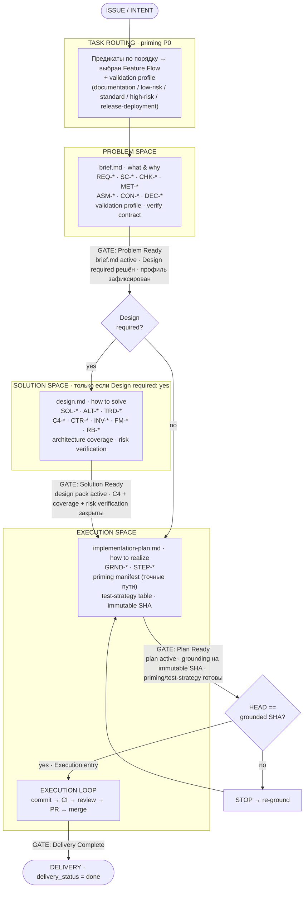

# Feature Flow — Вариант 1: Линейный конвейер «Stage → Gate»

Акцент: последовательность стадий, ворота (gates) и три семантических пространства
(problem → solution → execution).

Опорные файлы: `flows/routing.md`, `flows/feature.md`,
`flows/priming/context-priming.md`, `engineering/validation-profiles.md`.

