# Feature Flow — Вариант 2: Вертикальный Stage-Gate с артефактами и autonomy-boundaries

Акцент: кто принимает решение (autopilot / supervision / escalation),
priming-фазы P0/P1/P2, ветвление «Design required».

Опорные файлы: `flows/feature.md`, `flows/priming/context-priming.md`,
`engineering/autonomy-boundaries.md`, `engineering/validation-profiles.md`.

```mermaid
flowchart TD
    S0["0. INTAKE / ROUTING · priming P0<br/>issue → routing.md предикаты по порядку<br/>incident? bug? research? small-change? epic? refactor? → FEATURE<br/>решение: validation profile · (autopilot, если нет risk-триггеров)"]

    S1["1. BOOTSTRAP<br/>features/FT-XXX/README.md + brief.md (status: draft)"]

    S2["2. BRIEF — PROBLEM SPACE · priming P1<br/>owns: REQ-* NS-* SC-* CHK-* MET-* ASM-* CON-* DEC-*<br/>decision gate: «Design required: yes / no» ◀ supervision"]

    G_PR{{"GATE: Problem Ready<br/>brief.md → active"}}

    DGATE{Design<br/>required?}

    S3["3. DESIGN — SOLUTION SPACE · priming P1<br/>design pack (root design.md + constituents)<br/>C4 level: C4-00 / C1 / C2 / C3 / C4<br/>architecture coverage (5 аспектов)<br/>risk verification: contract / state / failure /<br/>concurrency / security / capacity / migration<br/>owns: SOL-* ALT-* TRD-* CTR-* INV-* FM-* RB-*<br/>(architecture/contract change → supervision)"]

    G_SR{{"GATE: Solution Ready<br/>design pack active"}}

    S4["4. IMPLEMENTATION PLAN — EXECUTION SPACE · priming P2<br/>derived-only: не переопределяет problem/solution<br/>grounding: immutable commit SHA + GRND-*<br/>priming manifest: точные пути (без globs)<br/>sequencing: STEP-* · test-strategy ← validation profile"]

    G_PLR{{"GATE: Plan Ready<br/>plan → active"}}

    PRE{preflight:<br/>HEAD == grounded SHA?}
    STOP[STOP · re-ground]

    S5["5. EXECUTION LOOP · (autopilot в scope; delete/schema → supervise)<br/>read priming → STEP-* → verify vs ожидание → tests → commit → push<br/>escalate: неясные требования / prod / auth / payment / scope-expansion"]

    S6["6. REVIEW & CI (глубина = validation profile)<br/>simplify → CI jobs → convergence pass → PR<br/>high-risk/release → отдельный non-authoring review + human approval"]

    G_DC{{"GATE: Delivery Complete"}}

    S7["7. CLOSURE<br/>PR merged → brief.md delivery_status = done<br/>обновить memory-bank: новые UC / domain-rules / ADR / паттерны"]

    S0 --> S1 --> S2 --> G_PR --> DGATE
    DGATE -->|yes| S3 --> G_SR --> S4
    DGATE -->|no| S4
    S4 --> G_PLR --> PRE
    PRE -->|no| STOP --> S4
    PRE -->|yes| S5 --> S6 --> G_DC --> S7
```

