# Feature Flow — Вариант 3: Routing-centric + петли обратной связи

Акцент: место Feature Flow среди других flows, петли эскалации и reconcile-циклы
(lifecycle / execution / review).

Опорные файлы: `flows/routing.md`, `flows/feature.md`,
`engineering/autonomy-boundaries.md` (правило эскалации 2–3 итерации).

```mermaid
flowchart TD
    ISSUE([ISSUE / TASK])
    ROUTING{{"ROUTING · P0<br/>предикаты по порядку"}}

    ISSUE --> ROUTING
    ROUTING -->|incident| F_INC[incident flow]
    ROUTING -->|bug| F_BUG[bug-fix flow]
    ROUTING -->|research| F_RES[research flow]
    ROUTING -->|small-change| F_SC[small-change flow]
    ROUTING -->|epic| F_EP[epic flow]
    ROUTING -->|refactor| F_RF[refactoring flow]
    ROUTING -->|ambiguous / high-risk| F_HR[HUMAN routing]
    ROUTING -->|"single delivery-unit"| FEATURE

    subgraph FEATURE["FEATURE FLOW"]
        B[brief.md] --> G1[[Problem Ready]]
        G1 --> DGATE{design?}
        DGATE -->|yes| D[design.md] --> G2[[Solution Ready]] --> PLAN
        DGATE -->|no| PLAN
        PLAN[implementation-plan.md] --> G3[[Plan Ready]]
        G3 --> PRE{preflight<br/>SHA ok?}
        PRE -->|no · re-ground| PLAN
        PRE -->|yes| LOOP

        LOOP["EXECUTION LOOP<br/>step → verify → tests → commit"]
        LOOP -->|ok| REVIEW["REVIEW + CI"]
        LOOP -->|fail / расхождение| REC{"reconcile<br/>2–3 итерации?"}
        REC -->|да · код-fix| LOOP
        REC -->|нет · причина upstream| ESC["ESCALATE · human gate<br/>требования / дизайн / план / constraint неверны"]
        ESC -.->|исправлен upstream| B

        REVIEW -->|findings| FIX[fix] --> LOOP
        REVIEW -->|clean · convergence pass| PR[PR]
        PR --> MERGE([merge → done])
    end

    MERGE --> KB[["обновить durable knowledge<br/>(memory-bank)"]]

    %% Петли:
    %% lifecycle-cycle : gate провалил → назад к соответствующему пространству
    %% execution-cycle : step fail → reconcile → повтор (макс 2–3), иначе escalate
    %% review-cycle    : review findings → fix → convergence pass
```

