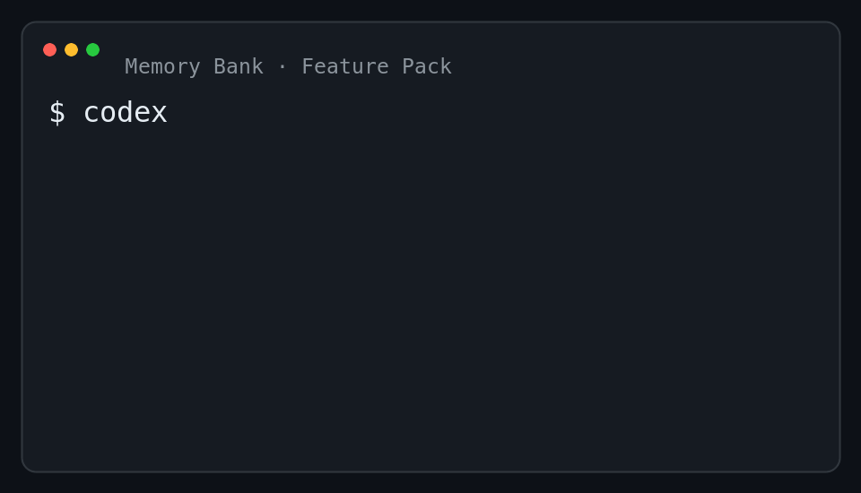
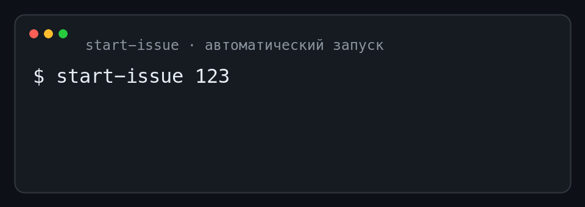

# Быстрый старт: первый запуск Memory Bank

Этот документ помогает установить Memory Bank и провести первую реальную
задачу через его процессы. На прохождение нужны Git, установленный и
авторизованный [Codex CLI](https://developers.openai.com/codex/cli/) и
репозиторий проекта.

Если Memory Bank уже адаптирован, переходите сразу к разделу
[«Выбрать сценарий запуска»](#3-выбрать-сценарий-запуска).

## 1. Проверить Codex

```bash
codex --version
codex login status
```

Если Codex не авторизован, выполните `codex login` и следуйте его инструкциям.

## 2. Установить и адаптировать Memory Bank

Перейдите в корень проекта. Для воспроизводимого запуска замените `main` в
адресе протокола на идентификатор конкретного коммита.

### Существующий проект

```bash
codex --search \
  'Это существующий проект. Выполни https://github.com/dapi/memory-bank/blob/main/docs/brownfield-adaptation-protocol.md.'
```

### Новый проект

```bash
codex --search \
  'Это новый проект. Выполни https://github.com/dapi/memory-bank/blob/main/docs/greenfield-integration-protocol.md.'
```

Агент изучит проект, установит содержимое шаблона и адаптирует постоянный
контекст. Полный порядок и критерии готовности описаны в
[инструкции по внедрению](adoption.md).

Перед продолжением просмотрите изменения:

```bash
git status --short
git diff --check
```

Если установлена необязательная утилита `memory-bank-cli`, дополнительно
выполните:

```bash
memory-bank-cli lint
memory-bank-cli doctor
```

## 3. Выбрать сценарий запуска

Используйте один из трёх сценариев. GIF показывают сокращённое
взаимодействие в терминале, а команды под ними можно копировать. Ответы агента
будут зависеть от задачи и
текущего состояния проекта.

### Вариант 1. Доверить выбор процесса Memory Bank


Это основной сценарий. Агент выполнит маршрутизацию Memory Bank, выберет
подходящий процесс и создаст только необходимые документы.

```bash
codex -C . \
  'Прочитай GitHub issue #123 и выполни его по процессу
memory-bank/flows/routing.md.'
```

### Вариант 2. Явно создать Feature Pack



Используйте этот сценарий, когда уже принято решение провести задачу через
`Feature Flow`.

```bash
codex -C .
```

В открывшейся сессии сначала создайте Feature Pack:

```text
Прочитай GitHub issue #123 и создай по нему Feature Pack согласно процессу
memory-bank/flows/feature.md.
```

После создания комплекта запросите ревью:

```text
Проведи ревью созданного комплекта документов и исправь замечания.
```

И только после ревью переходите к реализации:

```text
Приступай к реализации.
```

### Вариант 3. Автоматизировать запуск через start-issue



[`start-issue`](https://github.com/dapi/start-issue) получает задачу GitHub,
создаёт отдельную ветку и директорию worktree, а затем запускает настроенного
агента.

```bash
start-issue 123
```

В этом варианте команда использует агента и запрос из пользовательской или
проектной конфигурации `start-issue`.

### Что должно произойти

- Вариант 1 сначала выполняет `Task Routing`, а затем следует выбранному
  процессу.
- Вариант 2 создаёт Feature Pack, проводит его ревью и только после обязательных
  этапов переходит к реализации.
- Вариант 3 подготавливает изолированную рабочую директорию и передаёт задачу
  настроенному агенту.

Во всех вариантах агент должен выполнить проверки выбранного профиля и вернуть
новые устойчивые знания к их каноническим владельцам.

## 4. Посмотреть след задачи

Во время или после работы проверьте, какие документы и файлы появились:

```bash
git status --short
rg --files memory-bank/features
git diff --check
```

Нормальный результат — не максимальное количество документов, а достаточный
проверяемый след:

- исходная задача и выбранный маршрут;
- требования и критерии проверки;
- обоснование решения, если оно требовалось;
- изменения кода и тестов;
- подтверждения выполненных проверок;
- обновлённые долговременные знания проекта.

## 5. Проверить продолжение в новой сессии

Ценность Memory Bank особенно заметна при смене сессии. Завершите текущую
сессию и запустите новую:

```bash
codex -C . \
  'Продолжи текущую задачу. Начни с ./memory-bank/README.md,
./memory-bank/flows/routing.md и существующего комплекта документов задачи.
Не восстанавливай решение из предположений: используй канонические владельцы
фактов и сообщи, на каком этапе находится работа.'
```

Новая сессия должна определить состояние задачи по файлам репозитория, а не по
истории предыдущего чата.

## Автоматический запуск через Symphony

В этом репозитории есть экспериментальная интеграция Symphony с задачами
GitHub. Она выбирает задачи с меткой `codex-ready`, запускает Codex в
изолированной рабочей директории и после готового запроса на слияние переводит
задачу на проверку человеком.

Для локального запуска интеграции самого репозитория Memory Bank:

```bash
direnv allow
./bootstrap-symphony.sh
./run-symphony.sh
```

Не запускайте Symphony с широкими полномочиями или на всех открытых задачах без
предварительной проверки окружения. Полные требования и ограничения находятся
в [инструкции по Symphony](symphony-github-issues.md).

## Что читать дальше

- [Повседневная работа с Memory Bank](usage.md)
- [Внедрение Memory Bank](adoption.md)
- [Подготовка контекста задачи](context-priming.md)
- [Глоссарий](glossary.md)
