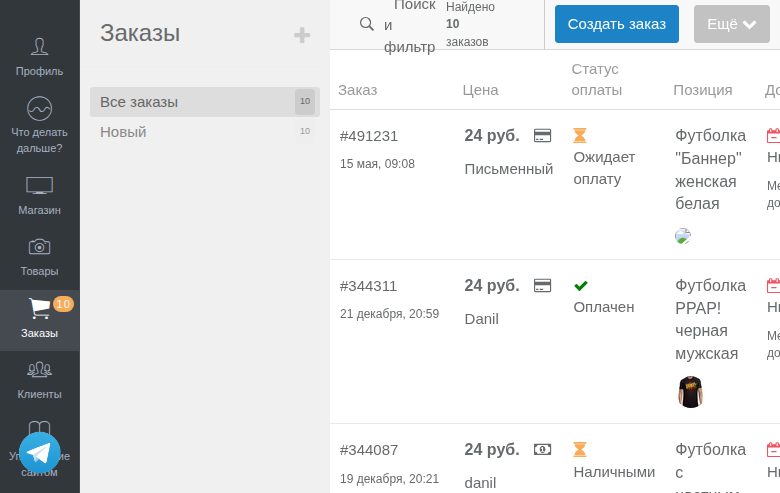
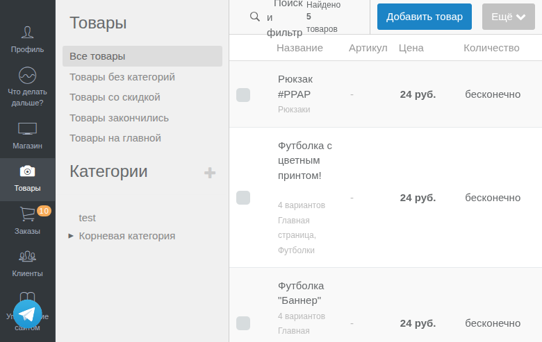
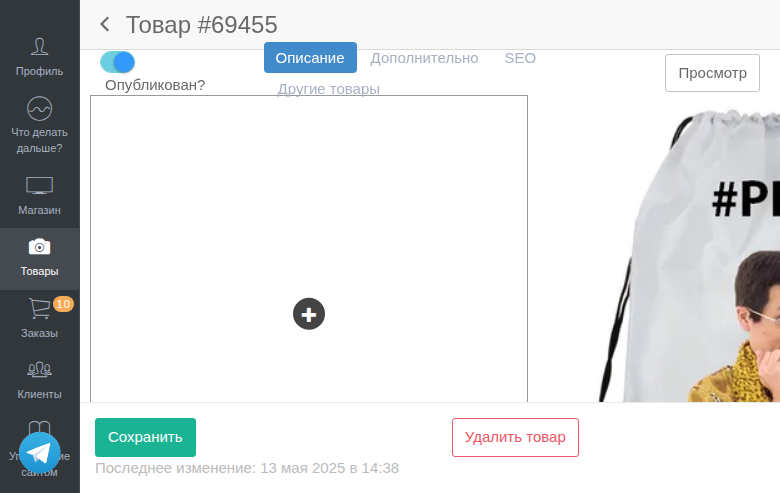
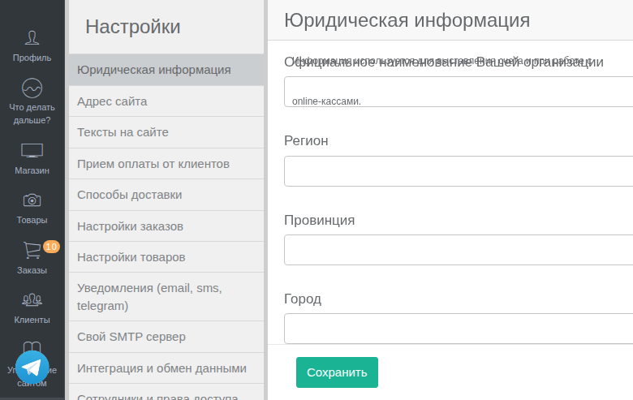

# Design Guide операторской панели

Справочник UI компонентов операторской панели Merchantly/КИОСК для AI-агентов.

## О документации

Этот справочник содержит описание переиспользуемых UI элементов операторской панели. Цель — стандартизировать разработку новых страниц и дать AI-агентам чёткие инструкции по работе с интерфейсом.

**UI Framework:** Inspinia (Bootstrap 3 based)

## Содержание

### [Контейнеры](containers.md)
Базовые layout-компоненты для организации контента:
- `_ibox.haml` — основной контейнер-блок
- `_ibox_collapsed.haml` — сворачиваемый блок
- `_ibox_widget.haml` — виджет-карточка для навигации
- `_callout.haml` — информационные сообщения
- `_popover.haml` — всплывающие подсказки

### [Кнопки](buttons.md)
Хелперы для создания кнопок (`operator_buttons_helper.rb`):
- Кнопки создания: `add_button`, `add_round_button`, `add_big_round_button`
- Кнопки удаления: `delete_button`, `delete_submit_button`, `delete_submit_icon`
- Переключатели: `toggle_button`, `smart_toggle_button`, `toggle_state_button`
- Редактирование: `edit_button`
- Сворачивание: `collapse_button`
- Сортировка: `operator_sort_handle`, `smart_operator_sort_handle`
- Header: `header_action_button`, `subsettings_button`
- Внешние ссылки: `external_link`

### [Формы](forms.md)
Хелперы и паттерны для форм:
- `resource_simple_form_for` — обёртка SimpleForm для ресурсов
- `operator_form_warnings` — предупреждения в форме
- `form_errors` — ошибки валидации
- `input_description` — поле описания
- `attribute_input` — универсальное поле атрибута
- Wrapper mappings для SimpleForm

### [Таблицы и пагинация](tables.md)
Компоненты для списков и табличных данных:
- `_empty_table.haml` — шаблон таблицы
- `_select_page.haml` — выбор страницы
- `_select_per_page.haml` — количество на странице
- Паттерны сортировки drag&drop
- Паттерны bulk actions

### [Метки и статусы](labels.md)
Компоненты для отображения состояний:
- `state_label` — базовая цветная метка
- `resource_moysklad_label` — метка синхронизации
- `product_state_label` — состояние товара
- Метки workflow состояний
- Метки заказов и оплаты

### [Навигация и поиск](navigation.md)
Компоненты навигации и фильтрации:
- `_header_search.haml` — поиск в заголовке
- `_search_form_modal.haml` — модальное окно поиска
- `operator_menu_helper.rb` — счётчики в меню
- Паттерны Filter Object

### [Ссылки](links.md)
Хелперы для создания ссылок (`operator_links_helper.rb`):
- `path_link` — ссылка на путь
- `url_link` — ссылка на URL
- `humanized_resource_link` — ссылка на ресурс
- `resource_public_link` — ссылка на публичную страницу
- `back_nav_link` — навигационная ссылка "Назад"
- `category_products_link` — ссылка на товары категории

### [Сворачиваемые секции](collapsible.md)
Паттерн для создания сворачиваемых секций с HTML5 `<details>`:
- `.collapsible-section` — стандартный CSS класс
- Расширенные настройки в формах
- Справочная информация и инструкции
- Детали ошибок

## Быстрый старт для агента

### Создание страницы списка ресурсов

```haml
.ibox
  .ibox-title
    %h5= t('.title')
    .ibox-tools
      = add_button new_operator_resource_path

  .ibox-header
    = render 'operator/base/header_search',
             result: @resources,
             options: @filter.options,
             query: @filter.query,
             reset_url: operator_resources_path,
             counter_title: t('.counter', count: @resources.total_count)

  .ibox-content
    - if @resources.any?
      .project-list
        %table.table.table-hover
          %thead
            %tr
              %th Название
              %th Статус
              %th.actions
          %tbody
            - @resources.each do |resource|
              %tr
                %td= link_to resource.title, edit_operator_resource_path(resource)
                %td= state_label resource.state, :success
                %td.actions
                  = edit_button edit_operator_resource_path(resource)
                  = delete_submit_icon operator_resource_path(resource)

      .row
        .col-md-6
          = paginate @resources
        .col-md-6.text-right
          = render 'operator/base/select_page', result: @resources
          = render 'operator/base/select_per_page', result: @resources
    - else
      .empty-state
        %p= t('.empty')
        = add_button new_operator_resource_path
```

### Создание формы редактирования

```haml
.ibox
  .ibox-title
    %h5= t('.title')
    .ibox-tools
      = smart_toggle_button @resource, :is_published
  .ibox-content
    = resource_simple_form_for @resource do |f|
      = form_errors @resource

      = f.input :title
      = f.input :description, as: :redactor

      = render 'operator/base/ibox_collapsed', title: 'SEO настройки', collapse: true do
        = f.input :meta_title
        = f.input :meta_description

      .form-actions
        = f.submit class: 'btn btn-primary'
        - unless @resource.new_record?
          = delete_button operator_resource_path(@resource)
```

## Структура файлов

```
memory-bank/domain/design-guide/
├── README.md          # Этот файл
├── buttons.md         # Кнопки
├── collapsible.md     # Сворачиваемые секции (details/summary)
├── containers.md      # Контейнеры (ibox, callout)
├── forms.md           # Формы
├── tables.md          # Таблицы и пагинация
├── labels.md          # Метки и статусы
├── navigation.md      # Навигация и поиск
├── links.md           # Ссылки
└── images/            # Скриншоты компонентов
```

## Основные файлы кодовой базы

| Компонент | Файл |
|-----------|------|
| Views | `app/views/operator/base/` |
| Кнопки | `app/helpers/operator_buttons_helper.rb` |
| Формы | `app/helpers/operator_form_helper.rb` |
| SimpleForm | `app/helpers/operator_resource_simple_form_helper.rb` |
| Labels | `app/helpers/operator_labels_helper.rb` |
| Links | `app/helpers/operator_links_helper.rb` |
| Menu | `app/helpers/operator_menu_helper.rb` |

## Принципы разработки

1. **Используй существующие компоненты** — не создавай новые, если есть аналог
2. **Следуй паттернам** — смотри примеры в существующих views
3. **Локализуй текст** — используй `I18n.t` для всех строк
4. **Добавляй empty states** — показывай сообщение когда список пуст
5. **Используй smart-хелперы** — `smart_toggle_button`, `smart_operator_sort_handle`
6. **Добавляй tooltip** — для иконок и сокращённого текста

## Скриншоты компонентов

### Список заказов


### Список товаров


### Форма товара


### Форма настроек


## Stage для тестирования

**URL:** https://demo.stage.kiiiosk.store/operator

Используй stage для визуальной проверки компонентов.
