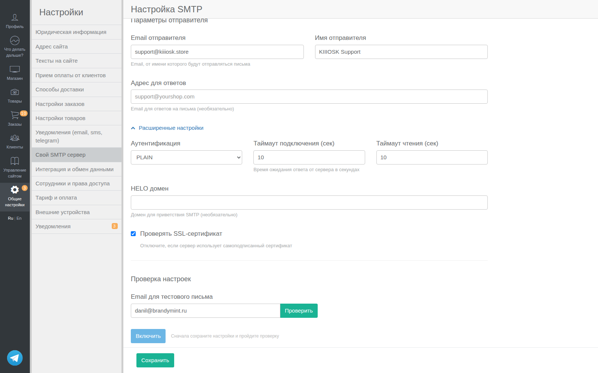

# Сворачиваемые секции (Collapsible)

Паттерн для создания сворачиваемых секций контента с использованием нативного HTML5 `<details>/<summary>`.

**CSS класс:** `.collapsible-section`
**Файл стилей:** `app/assets/stylesheets/operator/custom.sass`

---

## Когда использовать

- **Расширенные/дополнительные настройки** — редко используемые опции
- **Справочная информация** — инструкции, подсказки, FAQ
- **Длинные формы** — группировка второстепенных полей
- **Детали ошибок** — stack traces, debug info

## Базовый паттерн

### HAML

```haml
%details.collapsible-section
  %summary
    %i.fa.fa-chevron-down.m-r-xs
    = t('...')  -# или просто текст
  .m-t-md
    -# Содержимое секции
```

### Результат

- Кликабельный заголовок с стрелкой ▼
- Стрелка поворачивается на 180° при раскрытии
- Плавная анимация (0.2s ease)
- Ховер-эффект (подчёркивание)

### Скриншот



*Расширенные настройки SMTP — секция развёрнута*

---

## Примеры использования

### Расширенные настройки формы

```haml
= simple_form_for @resource do |f|
  = f.input :title
  = f.input :description

  %details.collapsible-section.m-t-lg
    %summary
      %i.fa.fa-chevron-down.m-r-xs
      = t('operator.common.advanced_settings')
    .m-t-md
      = f.input :meta_title
      = f.input :meta_description
      = f.input :custom_css

  = f.submit
```

### Справочная информация

```haml
%details.collapsible-section
  %summary
    %i.fa.fa-chevron-down.m-r-xs
    Как получить API ключ?
  .m-t-md
    %ol
      %li Перейдите в настройки аккаунта
      %li Откройте раздел "API"
      %li Нажмите "Создать ключ"
    .alert.alert-warning.m-t-md.m-b-0
      %i.fa.fa-exclamation-triangle
      Храните ключ в безопасном месте!
```

### Детали ошибки

```haml
- if @error.present?
  .alert.alert-danger
    = @error.message

    %details.collapsible-section.m-t-sm
      %summary
        %i.fa.fa-chevron-down.m-r-xs
        Технические детали
      .m-t-md
        %pre= @error.backtrace.first(10).join("\n")
```

### Изначально раскрытая секция

```haml
%details.collapsible-section{open: true}
  %summary
    %i.fa.fa-chevron-down.m-r-xs
    Важная информация
  .m-t-md
    %p Эта секция раскрыта по умолчанию
```

---

## CSS стили

```sass
// Универсальный collapsible паттерн
.collapsible-section
  summary
    cursor: pointer
    color: #337ab7
    list-style: none  // убираем стандартный маркер
    &::-webkit-details-marker
      display: none  // убираем маркер в Chrome/Safari
    &:hover
      text-decoration: underline
    .fa-chevron-down
      transition: transform 0.2s ease
      font-size: 12px
  &[open] summary .fa-chevron-down
    transform: rotate(180deg)
```

---

## Варианты стилизации

### Приглушённый стиль (для второстепенного контента)

```haml
%details.collapsible-section
  %summary.text-muted
    %i.fa.fa-chevron-down.m-r-xs
    Дополнительные опции
```

### С иконкой контекста

```haml
%details.collapsible-section
  %summary
    %i.fa.fa-chevron-down.m-r-xs
    %i.fa.fa-cog.m-r-xs
    Настройки
```

### В карточке

```haml
.ibox
  .ibox-content
    %details.collapsible-section
      %summary
        %i.fa.fa-chevron-down.m-r-xs
        Показать больше
      .m-t-md
        %p Дополнительный контент
```

---

## Сравнение с ibox_collapsed

### Визуальные отличия

| Характеристика | `collapsible-section` | `ibox_collapsed` |
|----------------|----------------------|------------------|
| **Цвет текста** | Синий (#337ab7) — как ссылка | Чёрный (#333) |
| **Размер шрифта** | Обычный (наследуется) | Крупный (18px) |
| **Позиция стрелки** | Слева от текста | Справа от текста |
| **Ширина** | По размеру текста (inline) | На всю ширину блока |
| **Иконка** | FontAwesome `fa-chevron-down` | IonIcon `ios-arrow-down` |
| **UX-ощущение** | "Раскрыть детали" | "Перейти в раздел" |

### Функциональные отличия

| Аспект | `collapsible-section` | `ibox_collapsed` |
|--------|----------------------|------------------|
| Использование | Inline в формах, справка | Отдельные блоки контента |
| Стиль | Лёгкий, текстовый | Карточка с заголовком |
| Вложенность | Можно вкладывать | Отдельный контейнер |
| Код | Нативный HTML5 | Partial + Bootstrap JS |
| Зависимости | Нет (CSS only) | Bootstrap collapse |

### Когда что использовать

**`collapsible-section`** — когда нужно:
- Скрыть редко используемые опции внутри формы
- Добавить справочную информацию / инструкции
- Показать технические детали (ошибки, debug)
- Не отвлекать от основного контента

**`ibox_collapsed`** — когда нужно:
- Выделить отдельную логическую секцию (SEO, интеграции)
- Визуально разделить крупные блоки настроек
- Показать что это "раздел", а не просто "детали"

**Рекомендация:** Используй `collapsible-section` для инлайн-контента внутри форм и страниц. Используй `ibox_collapsed` для крупных логических блоков на странице.

---

## Локализация

Добавь ключи в локали:

```yaml
ru:
  operator:
    common:
      advanced_settings: Расширенные настройки
      show_details: Показать детали
      hide_details: Скрыть детали
```

---

## Инструкции для агента

1. **Всегда добавляй стрелку** — `%i.fa.fa-chevron-down.m-r-xs` перед текстом
2. **Используй `.m-t-md`** для отступа содержимого от заголовка
3. **Добавляй `.m-t-lg`** к `%details` для отступа от предыдущего контента
4. **Локализуй текст** через `I18n.t`
5. **Для предупреждений внутри** используй `.alert.m-t-md.m-b-0`
6. **Не вкладывай** collapsible друг в друга более чем на 1 уровень
