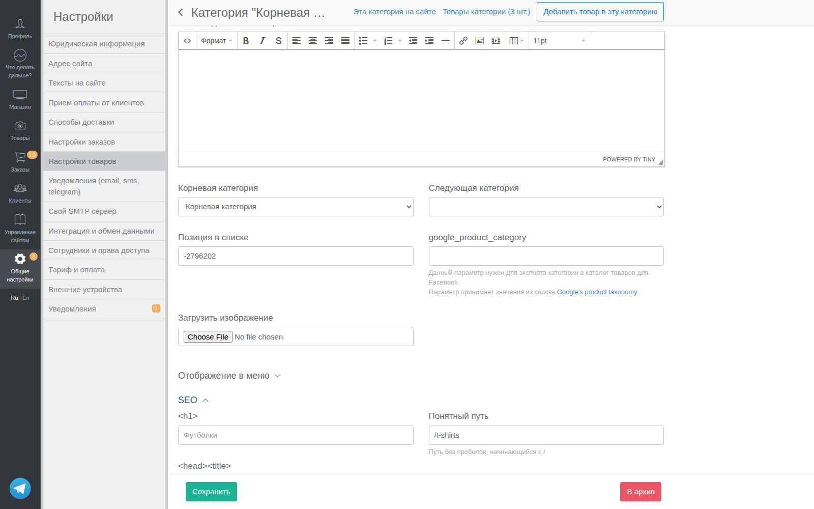
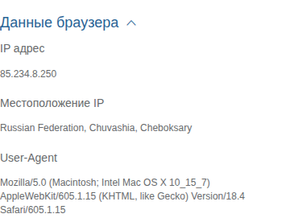

# Контейнеры (Containers)

Базовые контейнерные компоненты для организации контента в операторской панели.

## ibox — Основной контейнер

**Расположение:** `app/views/operator/base/_ibox.haml`

### Назначение

Базовый контейнер-блок для группировки связанного контента. Является основным layout-элементом в Inspinia framework.

### Структура

```haml
.ibox
  .ibox-title
    %h3= ibox_title
  .ibox-content
    = yield
```

### Параметры

| Параметр | Тип | Описание |
|----------|-----|----------|
| `ibox_title` | String | Заголовок блока |
| `yield` | Block | Содержимое блока |

### Примеры использования

```haml
= render 'operator/base/ibox', ibox_title: 'Настройки товара' do
  = simple_form_for @product do |f|
    = f.input :title
    = f.submit
```

### CSS классы

- `.ibox` — основной контейнер с тенью и отступами
- `.ibox-title` — шапка блока с заголовком
- `.ibox-content` — область содержимого

### Инструкция для агента

При создании новой страницы настроек или формы используй `_ibox.haml` как основной контейнер. Для страниц со списками ресурсов используй `.ibox` напрямую в разметке без partial.

---

## ibox_collapsed — Сворачиваемый блок

**Расположение:** `app/views/operator/base/_ibox_collapsed.haml`

### Назначение

Контейнер с возможностью сворачивания/разворачивания. Используется для группировки опциональных настроек или дополнительной информации.

### Структура

```haml
.collapse-box
  %a.ibox-title.collapse-link
    %h3.ibox-header.pull-left
      %span= title || 'No title'
      - if defined?(subtitle) && subtitle.present?
        %small.text-muted= subtitle
      %span.ibox-chevron= ion_icon 'ios-arrow-down'
    .clearfix
  .collapse-content{class: defined?(collapse) && collapse ? 'collapse' : ''}
    = yield
```

### Параметры

| Параметр | Тип | Описание |
|----------|-----|----------|
| `title` | String | Заголовок блока (обязательный) |
| `subtitle` | String | Подзаголовок (опциональный) |
| `collapse` | Boolean | Начальное состояние: true = свёрнут, false = развёрнут |
| `yield` | Block | Содержимое блока |

### Примеры использования

```haml
-# Развёрнутый блок
= render 'operator/base/ibox_collapsed', title: 'Дополнительные настройки' do
  = f.input :advanced_option

-# Свёрнутый по умолчанию
= render 'operator/base/ibox_collapsed', title: 'SEO настройки', subtitle: 'опционально', collapse: true do
  = f.input :meta_title
  = f.input :meta_description
```

### Скриншот



*SEO настройки категории — секция развёрнута*

### Инструкция для агента

Используй `_ibox_collapsed.haml` для опциональных настроек, которые не нужны при каждом редактировании. Если настройки критичны — используй обычный `_ibox.haml`.

---

## ibox_widget — Виджет в ibox

**Расположение:** `app/views/operator/base/_ibox_widget.haml`

### Назначение

Карточка-виджет для навигации к настройкам. Используется на страницах-хабах с группами настроек.

### Структура

```haml
.ibox-widget.ibox-widget-medium
  = feature_html_block key do
    .ibox.ibox-shadow
      .ibox-image
        %h2.ibox-header
          = link_to path, class: 'ibox-header-link' do
            = t [:operator, namespace, key, :title].join('.')
      .ibox-content
        = t [:operator, namespace, key, :details_html].join('.')
      = link_to t('operator.base.ibox_widget.more'), path, class: 'ibox-actions btn btn-primary btn-outline'
```

### Параметры

| Параметр | Тип | Описание |
|----------|-----|----------|
| `key` | Symbol | Ключ виджета из конфигурации |
| `namespace` | Symbol | Namespace для i18n и путей |

### Конфигурация путей

Пути к виджетам настраиваются в `ApplicationConfig.widget_paths`:

```ruby
# config/application.rb
widget_paths:
  modules_widgets:
    delivery: operator_delivery_settings_path
    payments: operator_payment_settings_path
```

### Примеры использования

```haml
-# Рендер группы виджетов
= render 'ibox_widgets', namespace: :modules_widgets

-# Отдельный виджет
= render 'ibox_widget', key: :delivery, namespace: :modules_widgets
```

### Инструкция для агента

Не создавай виджеты вручную. Используй существующую систему `ibox_widgets` с конфигурацией в `ApplicationConfig.widget_paths` и локализацией в `config/locales/operator.yml`.

---

## callout — Информационное сообщение

**Расположение:** `app/views/operator/base/_callout.haml`

### Назначение

Блок для отображения информационных сообщений, предупреждений или подсказок.

### Структура

```haml
.bs-callout{class: css_class}
  - if title.present?
    %h4.bs-callout-title= title
  = yield
```

### Параметры

| Параметр | Тип | Описание |
|----------|-----|----------|
| `css_class` | String | CSS класс для стилизации: `bs-callout-info`, `bs-callout-warning`, `bs-callout-danger` |
| `title` | String | Заголовок сообщения (опциональный) |
| `yield` | Block | Содержимое сообщения |

### Примеры использования

```haml
-# Информационное сообщение
= render 'operator/base/callout', css_class: 'bs-callout-info', title: 'Подсказка' do
  %p Это информационное сообщение для пользователя.

-# Предупреждение без заголовка
= render 'operator/base/callout', css_class: 'bs-callout-warning' do
  %p Внимание! Эта операция необратима.

-# Альтернативный способ (прямой HTML)
%div.bs-callout.bs-callout-info
  %p По-умолчанию в заказе требуется один из контактов: email или телефон.
```

### CSS классы

| Класс | Цвет | Использование |
|-------|------|---------------|
| `bs-callout-info` | Синий | Информация, подсказки |
| `bs-callout-warning` | Жёлтый | Предупреждения |
| `bs-callout-danger` | Красный | Ошибки, критичная информация |
| `bs-callout-success` | Зелёный | Успешные действия |

### Инструкция для агента

Используй `callout` для:
- Подсказок по заполнению форм
- Предупреждений о последствиях действий
- Информации о связанных настройках

Не используй для валидационных ошибок — для них есть `form_errors`.

---

## popover — Всплывающая подсказка

**Расположение:** `app/views/operator/base/_popover.haml`

### Назначение

Иконка со знаком вопроса, при наведении на которую появляется всплывающая подсказка.

### Структура

```haml
%span.popover-block{ data: { toggle: :popover, placement: :bottom, html: true, trigger: :hover, content: yield }}
  = ion_icon 'ios-help-outline'
```

### Параметры

| Параметр | Тип | Описание |
|----------|-----|----------|
| `yield` | Block/String | HTML-содержимое подсказки |

### Примеры использования

```haml
-# Подсказка к полю формы
= f.input :slug do
  = f.input_field :slug, class: 'form-control'
  = render 'operator/base/popover' do
    %p Уникальный идентификатор для URL.
    %p Используйте только латиницу, цифры и дефисы.

-# Подсказка рядом с заголовком
%h3
  Настройки доставки
  = render 'operator/base/popover' do
    Здесь можно настроить способы доставки для вашего магазина.
```

### Инструкция для агента

Используй `popover` для:
- Объяснения назначения полей формы
- Дополнительной информации, которая не нужна постоянно
- Технических деталей (форматы, ограничения)

Не перегружай интерфейс — popover должен быть дополнением, а не заменой понятного UI.

---

## Сравнение методов скрытия контента

| Метод | Когда использовать | JS | Файл |
|-------|-------------------|----|----|
| `ibox_collapsed` | Крупные блоки настроек | Bootstrap | `_ibox_collapsed.haml` |
| `.collapsible-section` | Inline в формах, справка | Нет (HTML5) | `custom.sass` |
| `data-toggle="collapse"` | Фильтры, панели | Bootstrap | Ручная разметка |

### Визуальные отличия ibox_collapsed и collapsible-section

| Характеристика | `ibox_collapsed` | `.collapsible-section` |
|----------------|------------------|------------------------|
| **Цвет текста** | Чёрный (#333) | Синий (#337ab7) — как ссылка |
| **Размер шрифта** | Крупный (18px) | Обычный (наследуется) |
| **Позиция стрелки** | Справа от текста | Слева от текста |
| **Ширина** | На всю ширину блока | По размеру текста (inline) |
| **UX-ощущение** | "Перейти в раздел" | "Раскрыть детали" |

### Статистика использования

| Метод | Кол-во в `app/views/` | Статус |
|-------|----------------------|--------|
| `ibox_collapsed` | **16** | Основной для блоков |
| `data-toggle="collapse"` | **3** | Legacy (только navbar toggles) |
| `.collapsible-section` | **5** | Новый стандарт для inline |

*Статистика на январь 2026*

**Рекомендация:** Для новых inline-элементов (расширенные настройки, инструкции) используй `.collapsible-section`. См. [collapsible.md](collapsible.md).

### Скриншоты методов скрытия контента

#### 1. ibox_collapsed (Bootstrap + partial)


*SEO настройки категории — карточка с заголовком и стрелкой*

#### 2. collapsible-section (HTML5 details/summary)


*Расширенные настройки SMTP — лёгкий inline-стиль*

#### 3. data-toggle="collapse" (Bootstrap)


*Данные браузера в заказе — кликабельный заголовок*
