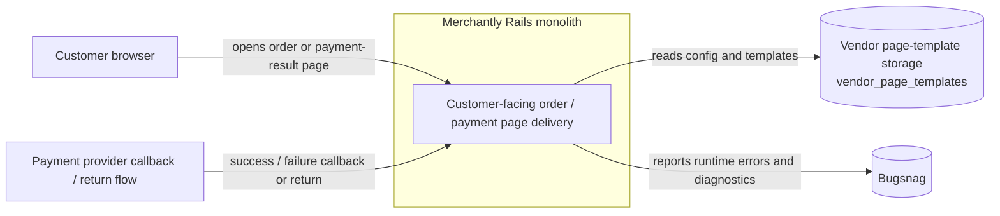
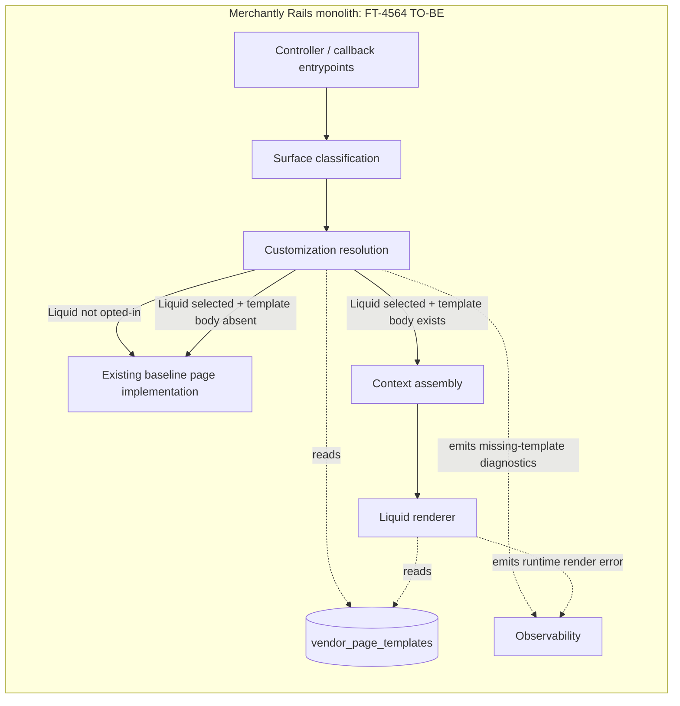

# FT-4564: Runtime Surfaces and Mapping Reference

## Роль документа

Этот файл не владеет canonical requirements или selected solution.

- `feature.md` остаётся owner problem space и verify inventory.
- `spec.md` остаётся owner feature-local selected design, accepted decisions и concrete contracts.
- Этот файл фиксирует grounding: как выглядит текущий runtime, какие surfaces реально существуют и как они мапятся на semantic page keys FT-4564.

## Change Model

| Surface | Type | Why it changes |
| --- | --- | --- |
| `order state result surfaces` | code / template | FT-4564 должна поддержать page-specific Liquid для `show`, `paid`, `created`, `canceled` |
| `payment callback result surface` | code / template | FT-4564 должна покрыть customer-facing success/failure pages после callback / return flow |
| `adjacent payment-entry surface` | boundary | Существующая `vendor/orders/payment` / `orders/payment` остаётся рядом со scope, но не входит в FT-4564 и должна быть явно отделена от order/payment result surfaces |
| `surface ownership contract` | contract | FT-4564 должна устранить semantic overlap между `show` / `created` / `canceled` / `paid` / `failed` на уровне renderable surfaces |
| `vendor page-key configuration` | config / schema | Selected solution использует dedicated `vendor_page_templates` persistence surface для стабильного opt-in на уровень semantic page key |
| `operator Liquid page catalog and editor` | UI / authoring | Оператору нужны bounded page-key list, toggle, preview и context reference для Liquid authoring |
| `resolution observability` | code / process | Для принятия ADR-0005 нужна проверяемая policy для fallback/error и evidence по её исполнению |
| `baseline React regression protection` | test / process | Без baseline automated regression protection migration gate для FT-4564 остаётся нефинализированным |

## Flow / Interaction Model

1. `GET /orders/:id` идёт в `Vendor::OrdersController#show` и в canonical runtime today уверенно покрывает ветки `show`, `paid` и `canceled`. В коде также есть debug override `?view=created` и остаточная `created`-ветка в `#show`, но canonical surface для `order_created` в FT-4564 трактуется как post-create `render_payment_page`, а не как regular public order-state branch. Если есть query-параметр `status`, он используется только для flash и PRG-redirect на чистый URL; status-only failure landing на `vendor/orders/show` остаётся owned by `show`, а не `failed`.
2. `match /payments/success|failure` в `Vendor::PaymentsController` работает как transition-only bridge: при наличии `order_id` редиректит на public order URL со status-параметром, иначе редиректит на vendor root с flash.
3. Provider-specific callbacks под `/payments/<provider>/success|failure` либо редиректят на public order URL для части success flows, где callback-контроллер реально резолвит order и выбирает redirect branch, либо рендерят `payment/show` с outcome-level props.
4. TO-BE operator preview для `payment/show(state=success|failure)` использует provider-neutral preview-only public route `/payments/page_template_preview/:state`, чтобы показать общую render surface без привязки к конкретному payment provider callback.
5. TO-BE operator preview для `orders/created` использует preview-only forced render через `/orders/:external_id?view=created`, потому что canonical runtime surface остаётся post-create `render_payment_page` и не имеет stable replayable customer URL.
6. FT-4564 resolver обязан применить explicit page-key opt-in policy для matched in-scope surfaces: `Liquid template body exists -> Liquid`, `template body absent -> existing baseline page implementation`. Если page-specific Liquid не выбран, request остаётся на текущем baseline behavior.
7. Существующая `vendor/orders/payment` page остаётся adjacent payment-entry surface вне scope FT-4564: её наличие важно для grounding `render_payment_page`, но она не получает vendor-facing page key в этой фиче.

## Current Surface Inventory

### Order-State Surfaces

| Candidate semantic page key | Current entrypoint | Current concrete surface | Current guaranteed context | Notes |
| --- | --- | --- | --- | --- |
| `order_show` | `GET /orders/:id` via `Vendor::OrdersController#show` when order stays in regular public state | `vendor/orders/show` | `order` | `status` query не меняет template, только flash + redirect |
| `payment_success` | `GET /orders/:id` via `Vendor::OrdersController#show` when order already marked paid | `vendor/orders/paid` | `order`, `isCurrentClientPresent`, `vendorRootPath` | Это customer-facing paid-state order page, а не единственный success entrypoint |
| `order_canceled` | `GET /orders/:id` via `Vendor::OrdersController#show` when order canceled | `vendor/orders/canceled` | `order`, `isCurrentClientPresent`, `vendorRootPath` | Может быть финальной landing page после неуспешной оплаты / отмены |
| `order_created` | Post-create render path in `Vendor::OrdersController#render_payment_page` when `TEMPLATE_CREATED` is selected | `vendor/orders/created` | `order`, `vendorRootPath` | `orders#show` содержит debug override и остаточную `created`-ветку, но canonical current inventory для FT-4564 считает `created` post-create surface |

### Adjacent Out-of-Scope Surface

| Adjacent surface | Current entrypoint | Current concrete surface | Why excluded from FT-4564 |
| --- | --- | --- | --- |
| Payment entry page | Post-create render path in `Vendor::OrdersController#render_payment_page` when `TEMPLATE_PAYMENT` is selected | `vendor/orders/payment` | Это шаг инициации/продолжения оплаты, а не result/order-state page; FT-4564 сознательно покрывает только `show`, `paid`, `created`, `canceled` и callback/result surface `payment/show` |

### Payment Result Callback Surfaces

| Candidate semantic page key | Current entrypoint | Current concrete surface | Current guaranteed context | Notes |
| --- | --- | --- | --- | --- |
| `payment_success` | `Vendor::Payment::BaseController#success` and subclasses when flow does not redirect to order page | `vendor/payment/show` with `state: 'success'` | `state`, `vendorUrl` | `order` здесь не гарантирован |
| `payment_failure` | `Vendor::Payment::BaseController#failure` and subclasses | `vendor/payment/show` with `state: 'failure'` | `state`, `vendorUrl` | `order` здесь не гарантирован |
| `payment_success` transition | `Vendor::PaymentsController#success` and success redirects from provider-specific callbacks | redirect bridge to public order URL with `status=success-pending`; generic bridge uses `order_id`, provider-specific callbacks may redirect after controller-specific order lookup | n/a | generic route guarantees only callback params; provider-specific order lookup is not universal | Transition-only bridge, не самостоятельный render template |
| `payment_failure` transition | `Vendor::PaymentsController#failure` | redirect to `/orders/:id?status=failed` when `order_id` is known | n/a | `order_id` only if callback carries it | Transition-only bridge, не самостоятельный render template; финальный `vendor/orders/show` остаётся owned by `show` |

### Payment Result Preview Surface

TO-BE preview contract intentionally отделяет authoring preview от реальных payment callbacks:

| Preview route | Renders | Context | Why |
| --- | --- | --- | --- |
| `/payments/page_template_preview/success` | `vendor/payment/show` with `state: 'success'` | `vendor`, success outcome metadata, optional `order` when explicit `order_id` is selected | Provider-neutral preview общей success-result surface; не вызывает payment provider callback logic |
| `/payments/page_template_preview/failure` | `vendor/payment/show` with `state: 'failure'` | `vendor`, failure outcome metadata, optional `order` when explicit `order_id` is selected | Provider-neutral preview общей failure-result surface; не привязывает preview к provider-specific payment route |

Эти routes существуют только как preview entrypoint для operator authoring. Generic `/payments/success|failure` остаётся redirect bridge, а `/payments/<provider>/success|failure` остаются provider callback / return routes.

## Mapping to Semantic Page Keys

Текущий runtime уже показывает, почему canonical unit не должен совпадать с concrete template key:

| Semantic key | Current reachable surfaces | Why this should stay semantic |
| --- | --- | --- |
| `payment_success` | `vendor/payment/show(state=success)`, PRG redirect to `/orders/:id?status=success-pending`, eventual `vendor/orders/paid` or `vendor/orders/show` | Один merchant-facing outcome проходит через callback page, redirect bridge и order-state surface; label `paid` не обещает единый route/template для всех success flows |
| `payment_failure` | `vendor/payment/show(state=failure)`, PRG redirect to `/orders/:id?status=failed`, eventual `vendor/orders/canceled` or `vendor/orders/show` | Alias `failed` не равен одному template key или одному controller action; ownership `failed` ограничен renderable failure result surface, а downstream order-state pages остаются owned by `canceled` или `show` |
| `order_show` | `vendor/orders/show` | Это наиболее стабильный current public order surface |
| `order_created` | `vendor/orders/created` | Сейчас выглядит как post-create surface, а не guaranteed branch публичной order page |
| `order_canceled` | `vendor/orders/canceled` | Это state-specific order surface, а не standalone payment failure page |

## Target Mapping and Architecture Reference

Целевая архитектура FT-4564 должна добавлять page-specific Liquid как bounded policy layer поверх существующего customer-facing rendering, а не как redesign публичного pipeline. Vendor-facing конфигурация остаётся привязанной к stable page keys, а не к controller branch-ам или template paths.

### C4-L2 Sketch

### C4-L3 Component View

### Target Shape

| Layer / responsibility | TO-BE role | Boundary |
| --- | --- | --- |
| `surface classification` | Сопоставляет текущий concrete runtime surface с semantic page key | Не хранит vendor policy и не рендерит страницу |
| `customization resolution` | Применяет FT-4564 opt-in policy: selected Liquid с body рендерит Liquid, selected Liquid без body уходит в baseline, not opted-in уходит в baseline | Является owner resolution contract для FT-4564 |
| `context assembly` | Собирает Liquid context из `vendor`, `order?`, outcome/state metadata и стандартных helpers | Не решает, какой renderer выбран |
| `baseline renderer` | Рендерит текущее baseline implementation для соответствующей surface/page key | Остаётся fallback и default path |
| `liquid renderer` | Рендерит custom Liquid только после подтверждения `Liquid selected + template body exists` | Runtime errors не переводятся обратно в baseline |
| `observability` | Раздельно публикует missing-template path и runtime render error | Не меняет user-facing resolution verdict |

### Resolution Decision Table

Таблица ниже фиксирует deterministic verdict только для renderable customer-facing surfaces. Transition-only bridges остаются вне таблицы, потому что не являются vendor-configurable page units.

| Page-specific Liquid selected | Liquid template body exists | Liquid render runtime status | Resolution verdict | User-visible result | Observability expectation |
| --- | --- | --- | --- | --- | --- |
| no | n/a | n/a | baseline default path | Рендерится existing baseline page implementation | Resolution verdict: `baseline because not opted-in` |
| yes | no | n/a | missing-template fallback | Рендерится existing baseline page implementation для того же page key / surface | Отдельный diagnostic signal для `template body absent` |
| yes | yes | success | Liquid render | Рендерится custom Liquid template | Resolution verdict: `liquid` |
| yes | yes | error | fail-fast runtime error path | Baseline page не подменяет ошибку; silent fallback не делается | Bugsnag / runtime error reporting с vendor context |

### Page-Key Context Matrix

Матрица ниже задаёт minimum honest contract для authoring и runtime resolution. Для `paid` и `failed` intentionally фиксируется semantic family, а не один concrete template path.

| Vendor-facing key | Internal semantic key | Render surface family | Template may rely on | Template may use when present | Template must not assume | Baseline implementation / fallback target |
| --- | --- | --- | --- | --- | --- | --- |
| `show` | `order_show` | `vendor/orders/show` | `vendor`, `order`, page state metadata, helpers | Surface-local decorations, уже существующие на baseline `show` surface | Callback-only payment outcome semantics вне order state | `vendor/orders/show` |
| `created` | `order_created` | `vendor/orders/created` | `vendor`, `order`, page state metadata, helpers | Surface-local decorations, уже существующие на post-create surface | Что это regular public order-state branch во всех flows | `vendor/orders/created` |
| `canceled` | `order_canceled` | `vendor/orders/canceled` | `vendor`, `order`, page state metadata, helpers | Surface-local decorations, уже существующие на canceled surface | Что это то же самое, что provider callback failure surface | `vendor/orders/canceled` |
| `paid` | `payment_success` | `vendor/orders/paid`; `vendor/payment/show(state=success)` | `vendor`, success outcome/state metadata, helpers | `order` на paid-state order surface; `order`, если callback surface его реально несёт; иные surface-local decorations | Что `vendor/orders/show` или transition bridge принадлежат `paid`; что `order` universally guaranteed на всех paid surfaces | Existing baseline implementation для matched `vendor/orders/paid` или `vendor/payment/show(state=success)` surface |
| `failed` | `payment_failure` | `vendor/payment/show(state=failure)` | `vendor`, failure outcome/state metadata, helpers | `order`, если текущий runtime surface его реально несёт; иные surface-local decorations | Что `vendor/orders/canceled` или `vendor/orders/show` принадлежит `failed`; что `order` всегда доступен; что failure flow сводится к redirect bridge | Existing baseline implementation для matched `vendor/payment/show(state=failure)` surface |

### Observability Contract

- Missing template body и runtime Liquid render error считаются разными failure classes и логируются раздельно.
- Resolution verdict должен быть наблюдаемым: `baseline because not opted-in`, `baseline because template body absent`, `liquid`.
- Runtime Liquid error должен сохранять vendor-aware error reporting path и не маскироваться автоматическим возвратом на baseline page.

## Order Context Note

Текущее состояние системы даёт такой evidence bundle:

- order-state surfaces `vendor/orders/show`, `vendor/orders/paid`, `vendor/orders/canceled` в `Vendor::OrdersController#show` и post-create `vendor/orders/created` рендерятся с `order`-bearing props;
- callback surface `payment/show` рендерится только с `state` и `vendorUrl`;
- generic `/payments/success|failure` routes могут вообще закончиться редиректом на vendor root, если callback не несёт usable `order_id`.

Вывод для ADR-0005:

- `order_show`, `order_created`, `order_canceled` можно проектировать как pages с required `order`;
- `payment_success` и `payment_failure` нельзя честно объявлять pages с universally required `order`, пока callbacks не нормализованы в один order-aware surface;
- минимальный честный baseline для payment result pages сегодня — `vendor + outcome metadata`, а `order` только `optional`.
