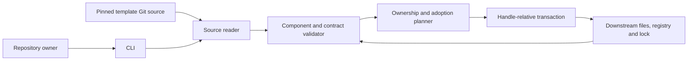

# FT-141: Design

## Design pack

| Relation | Owner | Facts |
| --- | --- | --- |
| root | design.md | SOL/SD/C4/INV/FM/RB и cross-view mapping |
| external-dependency | [ADR-002](../../adr/ADR-002-component-document-contracts.md) | Граница компонентов; candidate; independent decision review pending |
| constituent | [Normative contract](../../../docs/component-wire-format.md) | CTR-01: sole behavior and serialization owner; candidate pending review |
| derived-view | [Overview](../../../docs/components.md) | Navigation only; no independent protocol facts |

CLI implementation boundary: [CLI #62](https://github.com/dapi/memory-bank-cli/issues/62),
[CLI delivery contract](https://github.com/dapi/memory-bank-cli/blob/a0811c40141bd42f17a8ff3f5320f391c1f1197b/docs/component-delivery.md).
Это external delivery owner, а не второй владелец generic component protocol.

## Selected solution

SOL-01 / SD-01: декларативный payload manifest и замыкание зависимостей. Реализует REQ-01/07.
SOL-02 / SD-02: расширение существующего ownership transaction engine без параллельного writer; REQ-02/04/09.
SOL-03 / SD-03: immutable validation bundles и registry explicit adoption; REQ-03/05.
SOL-04 / SD-04: bridge capability gate и отдельный migration opt-in; REQ-06/08.
ALT-01: отдельные repositories компонентов — больше координации версий; отложено по ADR.
ALT-02: activation только через frontmatter — не обнаруживает исчезновение маркера; отвергнуто по issue.

## C4 applicability and models

C4-01: C1/C2 нужны для границ template source, CLI и downstream repository.
C3 нужен для reader/validator/planner/transaction; C4 code diagram не нужен для декларативного протокола.

CLI исполняется синхронно локально, читает pinned Git objects и файлы через существующие
безопасные path primitives. Сетевой fetch принадлежит текущему source resolver, validation
не отправляет документы наружу. Planner не пишет; transaction проверяет preconditions и
фиксирует lock последним. Повторная команда сравнивает состояние и не создаёт drift.

## 4+1 Viewpoint Coverage Decision and cross-view correspondence

Logical: SOL-01/03 и CTR-01; Process: planner → preflight → transaction/rollback;
Development: template declarations и CLI internal/ownership + doctor/cli;
Physical: локальные Git source/downstream files; +1: SC-01…12 из brief.
Все SC используют ту же границу CLI/source/repository; SC-04/05 дополнительно проходят registry
и bundles, SC-06/08 — capability gate. SC-09 проверяет path confinement на границе source reader/planner и transaction. Общих скрытых runtime services нет.

## Architecture Coverage Decision

State/identity/migration: CTR-01 и SOL-02/03. Concurrency/atomicity: существующий transaction.
Integration/compatibility: SOL-04. UI/API/auth/financial processing: не применимы.
Адаптеры — payload assets с dependencies, не отдельный runtime plugin API.

## Invariants and failures

INV-01: DNA не требует Documents/Flows; Documents не требует Flows.
INV-02: факт adoption имеет единственного owner; projections согласованы, lock контролирует integrity.
INV-03: успешный rollback восстанавливает исходное состояние; ошибка rollback сохраняет recovery_required и блокирует новые записи до полной проверки восстановления. Pinned checks не заменяются новыми.
FM-01: отсутствующий/изменённый registry, неоднозначная identity, unsupported version → preflight conflict.
FM-02: concurrent/staged write failure → существующий rollback и сохранённый recovery staging при его ошибке.
FM-03: новый payload до CLI → capability отказ; legacy path остаётся доступен.

## Rollout and backout

RB-01: bridge подготовлен и проверен до component source. Supporting CLI и source PR связаны.
RB-02: до merge/release обычная установка закреплена на legacy; task не мигрирует live repositories.
RB-03: при успешном rollback неудачная миграция восстанавливает предыдущий lock/tree.
Ошибка rollback сообщает recovery_required, сохраняет staging и запрещает последующие
component mutations до восстановления; lock/tree не считаются достоверными. Component downgrade unsupported.

## Design verification

| Analysis | Required / method | Design result |
| --- | --- | --- |
| Contract compatibility | yes / envelope and bundle dependency walkthrough | CTR-01 separates legacy/v1 from components/v1; frozen transitive rules and unsupported cases are explicit |
| State/transition completeness | yes / operation table and history replay walkthrough | Create/adopt/migrate/transition/move have one state owner; detach/delete/context changes reject |
| Failure propagation | yes / source → planner → transaction tracing | Preflight errors precede writes; failed rollback retains recovery state; committed cleanup failures are distinguished |
| Concurrency/ordering | yes / existing transaction preconditions review | Observed file/lock identities are rechecked, lock commits last; stale plans fail |
| Security boundaries | yes / path and source threat walkthrough | Git object identity, portable path collisions and handle-relative writes cover source/destination boundaries |
| Capacity/latency | no / bounded local synchronous tool | No latency or throughput SLA; resource errors propagate without treating partial state as success |
| Migration/evolution | yes / legacy snapshot and digest walkthrough | Approval binds complete write intent; equal finding multisets preserve legacy pass/fail; new documents never autojoin |

These are completed design analyses against CTR-01, not claims that implementation tests ran.
Automated transaction/contract tests and actual binary fixtures confirm the implementation later.
REQ-01/07 → SOL-01/INV-01; REQ-02/04 → SOL-02/INV-02/03/FM-01/02;
REQ-03/05 → SOL-03/CTR-01; REQ-06/08 → SOL-04/RB-01…03/FM-03; REQ-09 → SOL-02/INV-03 и SC-09 path confinement.
