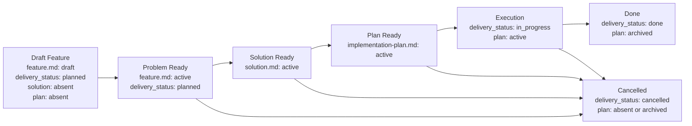

# Feature Flow

Этот документ задает порядок появления feature-артефактов. Агент должен вести feature package по стадиям и не создавать downstream-артефакты раньше, чем созрел их upstream-owner.

## Package Rules

1. Все документы одной фичи живут в `memory-bank/features/FT-XXX/`.
2. **Feature = vertical slice.** Одна фича — одна единица пользовательской ценности, пронизывающая все затронутые слои системы (UI, API, storage, infra). Горизонтальная нарезка ("все endpoints", "весь UI") допустима только для чисто инфраструктурных или рефакторинговых задач и должна быть явно обоснована через `NS-*`.
3. `feature.md` — canonical owner problem space: problem, outcome, scope, non-scope, assumptions, constraints, unresolved blocking decisions и canonical verify contract delivery-единицы.
4. `solution.md` — canonical owner solution space: selected design, accepted feature-local decisions, solution structure, internal flow, concrete contracts, solution-level failure modes, local rollout/backout semantics и ссылки на принятые ADR.
5. `README.md` создается вместе с `feature.md` и остается routing-слоем на всем lifecycle.
6. Lifecycle owner для `delivery_status` — только canonical `feature.md`. `solution.md`, feature-level `README.md` и `implementation-plan.md` не дублируют это поле.
7. `solution.md` появляется только после `Problem Ready`. `implementation-plan.md` появляется только после `Solution Ready`.
8. `implementation-plan.md` — derived execution-документ. Он не должен существовать, пока sibling `solution.md` не стал `status: active`.
9. Для canonical `feature.md`, canonical `solution.md`, feature-level `README.md` и `implementation-plan.md` используй wrapper-шаблоны из `memory-bank/flows/templates/feature/`: сам template-файл имеет `doc_function: template`, а frontmatter/body инстанцируемого документа живут внутри embedded template contract.
10. Смысл стабильных идентификаторов (`REQ-*`, `SOL-*`, `SD-*`, `STEP-*` и т.д.) задается в секции «Stable Identifiers» ниже.
11. Acceptance scenarios (`SC-*`) покрывают vertical slice end-to-end: от входного события до наблюдаемого результата через все затронутые слои. Тестирование отдельного слоя в изоляции допустимо как implementation detail плана, но не заменяет end-to-end acceptance.
12. **Связь с task tracker.** При создании feature package агент обязан добавить в исходную задачу или ticket ссылку на `feature.md`, а после появления downstream-документов — ссылки на `solution.md` и `implementation-plan.md`.
13. Если фича является частью более крупной инициативы, `feature.md` может зависеть от PRD из `memory-bank/prd/`, но PRD не заменяет сам feature package.
14. Если фича создает новый устойчивый сценарий проекта или materially changes существующий, соответствующий `UC-*` в `memory-bank/use-cases/` должен быть создан или обновлен до closure.

## Выбор шаблона `feature.md`

`short.md` допустим только если одновременно выполняются все условия:

1. problem space можно описать через `REQ-*`, `NS-*`, максимум один `CON-*`, один `EC-*`, один `CHK-*` и один `EVID-*`;
2. в `feature.md` не нужны `ASM-*`, `DEC-*`, feature-specific `NEG-*`, больше одного acceptance scenario или outcome-таблица с несколькими метриками;
3. verify укладывается в один основной check без quality slices и без нескольких acceptance scenarios;
4. scope и verify понятны без длинного problem narrative и без нескольких upstream dependencies.

Если хотя бы одно условие нарушается, агент обязан выбрать или сделать upgrade до `large.md` до продолжения работы.

**Важно:** solution-space complexity сама по себе больше не требует upgrade `feature.md` до `large.md`. Если problem space остаётся компактным, short feature допустим даже при более подробном `solution.md`.

## Small Feature Path

`solution.md` обязателен для любого feature package. Пропускать его нельзя: иначе selected design неизбежно вернется в `feature.md` или `implementation-plan.md`.

Для small feature допускается короткая форма `solution.md`:

- минимум один `SOL-*` с выбранным подходом;
- компактный `Change Surface`;
- ссылки на `REQ-*`, которые закрывает решение;
- остальные секции (`SD-*`, `CTR-*`, `FM-*`, `RB-*`, ADR refs) добавляются только если они реально нужны.

## Migration Strategy

- Новые feature packages обязаны сразу следовать структуре `feature.md -> solution.md -> implementation-plan.md`.
- Существующие feature packages без `solution.md` могут оставаться в legacy-виде, пока их не редактируют.
- Если legacy package редактируется так, что меняется или дописывается solution-space content, accepted design должен быть вынесен в `solution.md` до следующего существенного обновления `implementation-plan.md`.
- Миграция может происходить постепенно, package-by-package; migrated example должен оставаться доступным в `examples/`.

## Lifecycle

## Transition Gates

Каждый gate — набор проверяемых предикатов. Переход допустим тогда и только тогда, когда все предикаты истинны.

### Bootstrap Feature Package

- [ ] `README.md` создан по шаблону `templates/feature/README.md`
- [ ] `feature.md` создан по шаблону `short.md` или `large.md`
- [ ] `solution.md` отсутствует
- [ ] `implementation-plan.md` отсутствует

### Draft Feature → Problem Ready

- [ ] `feature.md` → `status: active`
- [ ] секция `What` содержит ≥ 1 `REQ-*` и ≥ 1 `NS-*`
- [ ] секция `Verify` содержит ≥ 1 `SC-*`
- [ ] каждый `REQ-*` прослеживается к ≥ 1 `SC-*` через traceability matrix
- [ ] секция `Verify` содержит ≥ 1 `CHK-*` и ≥ 1 `EVID-*`
- [ ] если deliverable нельзя принять без negative/edge coverage → ≥ 1 `NEG-*`
- [ ] `feature.md` не содержит accepted solution decisions, `How`, `Change Surface`, solution-level `Flow`, `CTR-*`, `FM-*`, `RB-*` или rollout/backout prose

### Problem Ready → Solution Ready

- [ ] `solution.md` создан по шаблону `templates/feature/solution.md`
- [ ] `solution.md` → `status: active`
- [ ] `solution.md` содержит ≥ 1 `SOL-*`
- [ ] `solution.md` ссылается минимум на один canonical `REQ-*` из sibling `feature.md`
- [ ] selected design стабилизирован настолько, что downstream execution sequencing больше не конкурирует с ним за ownership
- [ ] accepted feature-local decisions перенесены в `SD-*`, а architectural / reusable / cross-feature decisions оформлены в accepted ADR
- [ ] если solution зависит от ADR, соответствующий ADR имеет `decision_status: accepted`
- [ ] `implementation-plan.md` отсутствует

### Solution Ready → Plan Ready

- [ ] агент выполнил grounding: прошёлся по текущему состоянию системы (relevant paths, existing patterns, dependencies) и зафиксировал результат в discovery context секции `implementation-plan.md`
- [ ] `implementation-plan.md` создан по шаблону `templates/feature/implementation-plan.md`
- [ ] `implementation-plan.md` → `status: active`
- [ ] `implementation-plan.md` содержит ≥ 1 `PRE-*`, ≥ 1 `STEP-*`, ≥ 1 `CHK-*`, ≥ 1 `EVID-*`
- [ ] discovery context в `implementation-plan.md` содержит: relevant paths, local reference patterns, unresolved questions (`OQ-*`), test surfaces и execution environment
- [ ] шаги и workstreams в `implementation-plan.md` ссылаются на canonical IDs из `feature.md` и solution refs из `solution.md` / ADR

### Plan Ready → Execution

- [ ] `feature.md` → `delivery_status: in_progress`
- [ ] `solution.md` → `status: active`
- [ ] `implementation-plan.md` → `status: active`
- [ ] `implementation-plan.md` фиксирует test strategy: automated coverage surfaces, required local/CI suites
- [ ] каждый manual-only gap имеет причину, ручную процедуру и `AG-*` с approval ref

### Execution → Done

- [ ] все `CHK-*` из `feature.md` имеют результат pass/fail в evidence
- [ ] все `EVID-*` из `feature.md` заполнены конкретными carriers (путь к файлу, CI run, screenshot)
- [ ] delivered behavior не противоречит accepted `SOL-*` / `SD-*` / ADR refs
- [ ] automated tests для change surface добавлены или обновлены
- [ ] required test suites зелёные локально и в CI
- [ ] каждый manual-only gap явно approved человеком (approval ref в `AG-*`)
- [ ] simplify review выполнен: код минимально сложен или complexity обоснована ссылкой на `CON-*`, `FM-*`, `SD-*` или accepted ADR
- [ ] если feature добавляет новый stable flow или materially changes существующий project-level scenario, соответствующий `UC-*` создан или обновлен и зарегистрирован в `memory-bank/use-cases/README.md`
- [ ] `feature.md` → `delivery_status: done`
- [ ] `implementation-plan.md` → `status: archived`

### → Cancelled (из любой стадии после Draft Feature)

- [ ] `feature.md` → `delivery_status: cancelled`
- [ ] `implementation-plan.md` отсутствует ∨ `status: archived`

## Boundary Rules

1. `feature.md` обязан содержать секции `What` и `Verify`.
2. `feature.md` владеет только problem space: problem, outcome, scope, non-scope, assumptions, constraints, unresolved blocking decisions и canonical verify contract.
3. `feature.md` не должен содержать `How`, selected design, accepted solution decisions, change surface, internal flow, concrete solution contracts, solution-level failure modes, rollout/backout semantics или execution sequencing.
4. `DEC-*` в `feature.md` означает только unresolved blocking decisions. Как только решение принято, оно переезжает в `solution.md` как `SD-*` или в ADR.
5. `solution.md` владеет только solution space: selected design, accepted feature-local decisions, solution structure, internal flow, concrete contracts, solution-level failure modes, local rollout/backout semantics и ссылки на принятые ADR.
6. `delivery_status` остается только на `feature.md`; `solution.md` и `implementation-plan.md` не дублируют lifecycle state delivery-единицы.
7. `solution.md` не должен переопределять business requirements, scope, acceptance criteria, canonical checks, evidence contract или execution sequencing.
8. Если feature зависит от ADR, canonical owner этой зависимости — `solution.md`; `proposed` ADR не считается finalized design.
9. Если feature зависит от канонического use case, `feature.md` ссылается на соответствующий файл в `memory-bank/use-cases/`. Use case остается owner-ом trigger/preconditions/main flow/postconditions на уровне проекта, а `feature.md` фиксирует только slice-specific проблему и verify.
10. `implementation-plan.md` остается derived execution-документом: он ссылается на canonical IDs из `feature.md` и solution refs из `solution.md` / ADR, фиксирует discovery context и test strategy для исполнения и не переопределяет scope, selected design, blockers, acceptance criteria или evidence contract.
11. Если меняются scope, assumptions, constraints, acceptance criteria или evidence contract, сначала обновляется `feature.md`. Если меняются selected design, local accepted decisions, contracts, failure modes или rollout/backout semantics, сначала обновляется `solution.md` или ADR. Только потом обновляется downstream-план.
12. Если численный target threshold относится только к одной delivery-единице, canonical owner — соответствующий `feature.md`. Поднимать такой KPI в project-level документ можно только после того, как он стал shared upstream fact для нескольких feature.
13. Хороший `implementation-plan.md` начинается с discovery context: relevant paths, local reference patterns, unresolved questions, test surfaces и execution environment должны быть зафиксированы до sequencing изменений.
14. Для рискованных, необратимых или внешне-эффективных действий `implementation-plan.md` должен явно описывать human approval gates и не скрывать их внутри prose шага.

## Test Ownership Summary

Canonical testing policy живёт в [../engineering/testing-policy.md](../engineering/testing-policy.md). Ниже — выжимка, достаточная для создания feature package без обращения к policy-документу.

1. **Canonical test cases** delivery-единицы задаются в `feature.md` через `SC-*`, feature-specific `NEG-*`, `CHK-*` и `EVID-*`.
2. `solution.md` может фиксировать solution-level `CTR-*`, `FM-*` и `RB-*`, но не владеет test strategy и не подменяет canonical verify contract.
3. `implementation-plan.md` владеет только стратегией исполнения: какие suites добавить, какие gaps временно manual-only и почему.
4. **Sufficient coverage** = покрыт основной changed behavior, новые или измененные contracts из `solution.md` / ADR, критичные failure modes из `FM-*` и feature-specific negative/edge scenarios, если они меняют verdict. Процент line coverage сам по себе недостаточен.
5. **Manual-only допустим** только как явное исключение (live infra, hardware, недетерминированная среда). Для каждого gap — причина, ручная процедура или `EVID-*`, owner follow-up и approval ref через `AG-*`.
6. **К Problem Ready** `feature.md` уже фиксирует test case inventory: минимум один `SC-*`, traceability к `REQ-*`. **К Solution Ready** `solution.md` фиксирует delivered design, contracts и local decisions. **К Done** — automated tests добавлены, обязательные suites зелёные локально и в CI.
7. **Simplify review** — отдельный проход после функциональных тестов, до closure. Цель: убедиться, что код минимально сложен. Три похожие строки лучше premature abstraction. Complexity оправдана только со ссылкой на `CON-*`, `FM-*`, `SD-*` или accepted ADR.
8. **Verification context separation** — функциональная верификация, simplify review и acceptance test — три логически отдельных прохода. Между проходами агент формулирует выводы до начала следующего. Для short features допустимо в одной сессии, но simplify review не пропускается.

## Stable Identifiers

### Feature IDs

| Prefix | Meaning | Used in |
| --- | --- | --- |
| `MET-*` | outcome-метрики | `feature.md` |
| `REQ-*` | scope и обязательные capability | `feature.md` |
| `NS-*` | non-scope | `feature.md` |
| `ASM-*` | assumptions и рабочие предпосылки | `feature.md` |
| `CON-*` | ограничения problem space | `feature.md` |
| `DEC-*` | unresolved blocking decisions | `feature.md` |
| `INV-*` | problem-level invariants | `feature.md` |
| `EC-*` | exit criteria | `feature.md` |
| `SC-*` | acceptance scenarios | `feature.md` |
| `NEG-*` | negative / edge test cases | `feature.md` |
| `CHK-*` | проверки | `feature.md`, `implementation-plan.md` |
| `EVID-*` | evidence-артефакты | `feature.md`, `implementation-plan.md` |
| `RJ-*` | rejection rules | `feature.md`, `implementation-plan.md` |

### Solution IDs

| Prefix | Meaning | Used in |
| --- | --- | --- |
| `SOL-*` | solution elements / selected design blocks | `solution.md` |
| `SD-*` | accepted feature-local solution decisions | `solution.md` |
| `CTR-*` | concrete solution contracts | `solution.md` |
| `FM-*` | solution-level failure modes | `solution.md` |
| `RB-*` | rollout / backout stages | `solution.md` |

### Plan IDs

| Prefix | Meaning | Used in |
| --- | --- | --- |
| `PRE-*` | preconditions | `implementation-plan.md` |
| `OQ-*` | unresolved questions / ambiguities | `implementation-plan.md` |
| `WS-*` | workstreams | `implementation-plan.md` |
| `AG-*` | approval gates for risky actions | `implementation-plan.md` |
| `STEP-*` | атомарные шаги | `implementation-plan.md` |
| `PAR-*` | параллелизуемые блоки | `implementation-plan.md` |
| `CP-*` | checkpoints | `implementation-plan.md` |
| `ER-*` | execution risks | `implementation-plan.md` |
| `STOP-*` | stop conditions / fallback | `implementation-plan.md` |

### Required Minimum

1. Любой canonical `feature.md` использует как минимум `REQ-*`, `NS-*`, `SC-*`, `CHK-*`, `EVID-*`.
2. Любой `feature.md` со `status: active` задает хотя бы один explicit test case через `SC-*`.
3. Short feature может использовать только минимальный problem-space набор из `short.md`; large feature использует расширенный набор feature IDs по необходимости.
4. Любой `solution.md` использует как минимум один `SOL-*` и связывает его минимум с одним `REQ-*` из sibling `feature.md`.
5. Любой `solution.md`, где есть принятые feature-local решения, использует `SD-*`; `CTR-*`, `FM-*` и `RB-*` применяются только когда соответствующая solution-semantics действительно нужна.
6. Любой `implementation-plan.md` использует как минимум `PRE-*`, `STEP-*`, `CHK-*`, `EVID-*`; при наличии ambiguity или human approval gates используются `OQ-*` и `AG-*`.

### Traceability Contract

1. Scope в `feature.md` фиксируется через `REQ-*`, non-scope через `NS-*`.
2. Verify в `feature.md` связывает `REQ-*` с test cases через `Acceptance Scenarios`, feature-specific `NEG-*`, `Traceability matrix`, `Test matrix` и `Evidence contract`.
3. `solution.md` связывает `REQ-*` из `feature.md` с `SOL-*`, `SD-*`, `CTR-*`, `FM-*`, `RB-*` и accepted ADR refs.
4. `implementation-plan.md` ссылается на canonical IDs из `feature.md` и solution refs из `solution.md` / ADR в колонках `Implements`, `Verifies` и `Evidence IDs`.
5. Если sequencing блокируется неизвестностью, план фиксирует её как `OQ-*`, а не прячет в prose.
6. Если выполнение требует человеческого подтверждения для рискованных действий, план фиксирует это через `AG-*`.
7. Если design меняется после `Solution Ready`, сначала обновляется `solution.md` или ADR, затем план.
