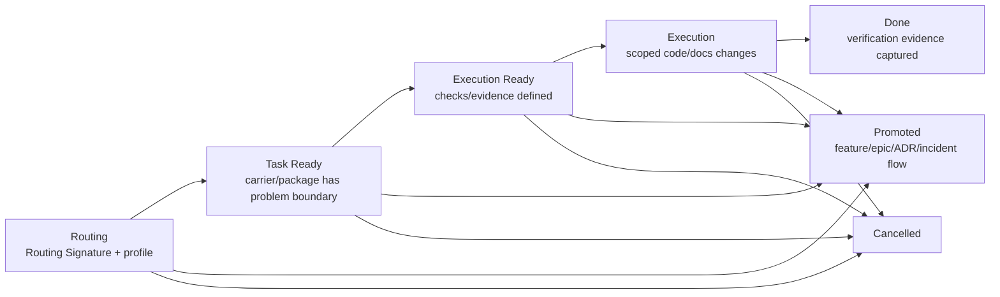

# Task Flow

`task-flow` применяется после selector-а из [`workflows.md`](workflows.md), когда выбран один из non-feature profiles:

- `tracker-only`
- `bugfix-compact`
- `refactor-small`
- `managed-task`

Этот flow не заменяет [`bugfix-flow.md`](bugfix-flow.md), [`refactor-flow.md`](refactor-flow.md), [`feature-flow.md`](feature-flow.md) или [`epic-flow.md`](epic-flow.md). Он задает общий lifecycle и правила carrier/package для non-feature задач; bugfix-процесс живет в `bugfix-flow`, refactor/chore-процесс - в `refactor-flow`.

Если задача создает новую capability, меняет устойчивый scenario, затрагивает API/schema/security/financial/integration/rollout contract или требует design reasoning, ее нужно повысить до `feature-package`, ADR или `epic-package` по promotion rules.

## Комплекты Документов Профилей

| Profile | Обязательные carriers | Опциональные carriers | Когда достаточно |
| --- | --- | --- | --- |
| `tracker-only` | GitHub issue/PR с Routing Signature, boundary и verification evidence | none | `tiny/small`, `low` risk, без contract change, без durable owner doc |
| `bugfix-compact` | GitHub issue/PR note по [`templates/task/bugfix.md`](templates/task/bugfix.md), процесс по [`bugfix-flow.md`](bugfix-flow.md) | `memory-bank/tasks/TASK-XXX/README.md` + `bugfix.md` | Дефект локален, root cause понятен, fix boundary и regression coverage помещаются в compact carrier |
| `refactor-small` | GitHub issue/PR note по [`templates/task/refactor.md`](templates/task/refactor.md), процесс по [`refactor-flow.md`](refactor-flow.md) | `memory-bank/tasks/TASK-XXX/README.md` + `refactor.md` | Observable behavior не меняется, invariants и verification помещаются в compact carrier |
| `managed-task` | `memory-bank/tasks/TASK-XXX/README.md` + `bugfix.md` или `refactor.md` | linked ADR/runbook/incident docs, evidence artifacts | Issue/PR carrier недостаточен, но full feature package не нужен |

`README.md` обязателен только для durable `memory-bank/tasks/TASK-XXX/` package. Для issue/PR-only profiles routing layer живет в issue/PR body или PR comment.

## Семейство Процессов

### `tracker-only`

```text
task/request -> routing signature -> scoped change -> focused verification -> PR/issue evidence
```

Используй для минимальных задач, где отдельный owner doc не нужен. Обязательные элементы процесса: зафиксировать boundary, выполнить проверку, оставить evidence в issue/PR.

### `bugfix-compact`

Используй [`bugfix-flow.md`](bugfix-flow.md). `task-flow` владеет carrier/package и promotion, `bugfix-flow` владеет symptom, reproduction, root cause, fix boundary и regression coverage.

### `refactor-small`

Используй [`refactor-flow.md`](refactor-flow.md). `task-flow` владеет carrier/package и promotion, `refactor-flow` владеет intent, behavior invariants, change surface, checkpoints и verification.

### `managed-task`

```text
routing -> TASK-XXX package -> primary owner doc -> checkpoints -> execution -> evidence -> package/PR closure
```

Используй, когда issue/PR carrier уже недостаточен, но feature package еще не нужен. Минимальный комплект: `README.md` + ровно один primary owner (`bugfix.md` или `refactor.md`). Все gates ниже применяются к package как к durable carrier.

## Правила Package

1. Durable non-feature package живет в `memory-bank/tasks/TASK-XXX/`.
2. `README.md` - routing/index layer package-а. Создается по [`templates/task/package-README.md`](templates/task/package-README.md).
3. `bugfix.md` - canonical owner compact bugfix-а по [`bugfix-flow.md`](bugfix-flow.md): symptom, reproduction, root cause, fix boundary, regression coverage.
4. `refactor.md` - canonical owner compact refactor/chore по [`refactor-flow.md`](refactor-flow.md): intent, behavior invariants, change surface, checkpoints, verification.
5. В одном `TASK-XXX/` должен быть ровно один primary task owner: `bugfix.md` или `refactor.md`, кроме случаев, когда package явно служит routing-index для нескольких follow-up tasks. Если появляется несколько independent delivery units, создай отдельные `TASK-*` или promote в `epic-package`.
6. `implementation-plan.md` внутри `TASK-XXX/` не создается. Sequencing и checkpoints должны помещаться в primary task owner. Если нужен полноценный execution contract, promote до `feature-package` или создай отдельный approved plan по upstream owner-решению.
7. `design.md` внутри `TASK-XXX/` не создается. Если нужен solution-space owner, alternatives/trade-off reasoning, C4, migration strategy или rollout/backout design, promote до `feature-package` или ADR + feature package.
8. Все owner-документы task package пишутся на русском языке; identifiers, paths, class/API names и внешние product names сохраняются как есть.
9. При создании durable `TASK-XXX/` добавь ссылку из исходного issue/PR на package docs.

## Жизненный Цикл



## Gates Переходов

### Routing -> Task Ready

- [ ] Routing Signature заполнен, включая `workflow_profile`.
- [ ] Promotion triggers из [`workflows.md`](workflows.md) проверены.
- [ ] Для compact profiles нет `risk=high/critical`.
- [ ] `contract_change=none` для `tracker-only`, `bugfix-compact`, `refactor-small`.
- [ ] Issue/PR carrier или `TASK-XXX/README.md` содержит ссылку на выбранный profile.
- [ ] Если есть `unknown` в `kind`, `risk`, `change_surface` или `contract_change`, задача не переходит в Task Ready без discovery или promotion.

### Task Ready -> Execution Ready

Для `bugfix-compact` / managed bugfix:

- [ ] Profile gates из [`bugfix-flow.md`](bugfix-flow.md) выполнены.

Для `refactor-small` / managed refactor:

- [ ] Profile gates из [`refactor-flow.md`](refactor-flow.md) выполнены.

Для `tracker-only`:

- [ ] Issue/PR carrier содержит краткий rationale, boundary, verification и evidence target.

### Execution Ready -> Execution

- [ ] Выбран worktree/branch по project git rules.
- [ ] Required docs/carriers созданы или явно не нужны для выбранного profile.
- [ ] Approval gates для risky/manual-only actions зафиксированы через `AG-*` или issue/PR comment.
- [ ] Test/verification commands соответствуют `AGENTS.md` и [`../engineering/testing-policy.md`](../engineering/testing-policy.md).

### Execution -> Done

- [ ] Code/docs changes не выходят за выбранный task boundary.
- [ ] Regression/focused verification выполнена или documented manual-only exception approved.
- [ ] Evidence carrier заполнен.
- [ ] PR/issue содержит routing signature или ссылку на durable task package.
- [ ] Если появились promotion triggers, они не замаскированы: задача promoted или явно остановлена.
- [ ] Для durable `TASK-XXX/` `delivery_status` обновлен до `done` или package оставлен с явным follow-up status.

### -> Promoted

Promotion обязателен, если появился любой trigger:

- новая или materially changed user/operator/system capability;
- API/event/schema/file format/CLI/security/financial/integration/rollout change;
- solution-space reasoning, ADR dependency, C4, migration strategy, rollout/backout или failure-mode design;
- high/critical risk;
- несколько independent delivery units;
- repeated review findings показывают, что проблема находится upstream.

## Общие Стабильные Идентификаторы

| Prefix | Значение | Где используется |
| --- | --- | --- |
| `ROUTE-*` | routing-решение или заметка выбора profile | issue/PR, `README.md` |
| `NS-*` | non-scope | `bugfix.md`, `refactor.md` |
| `CHK-*` | executable/manual check | `bugfix.md`, `refactor.md`, issue/PR |
| `EVID-*` | evidence carrier | `bugfix.md`, `refactor.md`, issue/PR |
| `OQ-*` | открытый вопрос | любой task carrier |
| `AG-*` | approval gate | managed package, issue/PR |

Bugfix identifiers (`SYM-*`, `REPRO-*`, `RC-*`, `FIX-*`) определены в [`bugfix-flow.md`](bugfix-flow.md). Refactor identifiers (`INT-*`, `INV-*`, `SURF-*`, `CP-*`) определены в [`refactor-flow.md`](refactor-flow.md).

## Правила Границ

1. Task flow владеет локальными non-feature работами. Он не должен становиться скрытым feature package.
2. Issue/PR-only profiles все равно требуют evidence. "No docs" не означает "no routing".
3. Durable `TASK-XXX/` package существует только когда issue/PR carrier недостаточен.
4. `TASK-XXX/` package не владеет architecture design. Если нужен design, task нужно повысить.
5. Bugfix-правила root cause, behavior-changing fix и regression coverage задает [`bugfix-flow.md`](bugfix-flow.md).
6. Refactor-правила invariants, checkpoints и запрета observable behavior change задает [`refactor-flow.md`](refactor-flow.md).
7. Manual-only verification должен включать причину, процедуру и approval ref.
8. Financial/security bugfixes требуют automated regression coverage, кроме явно approved manual-only исключения с причиной; иначе task нужно повысить.
